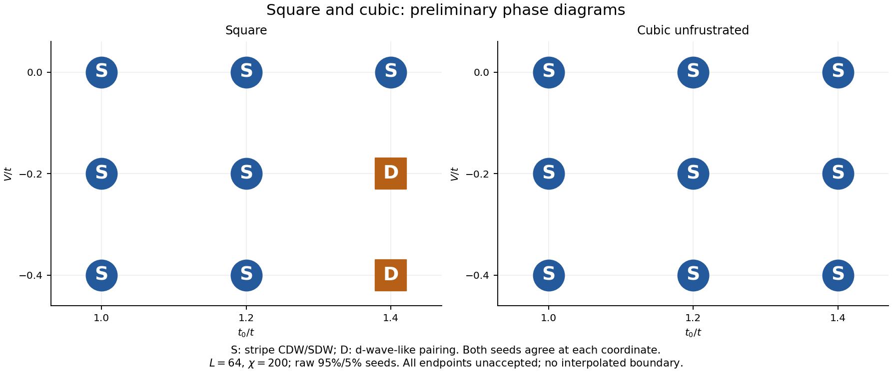
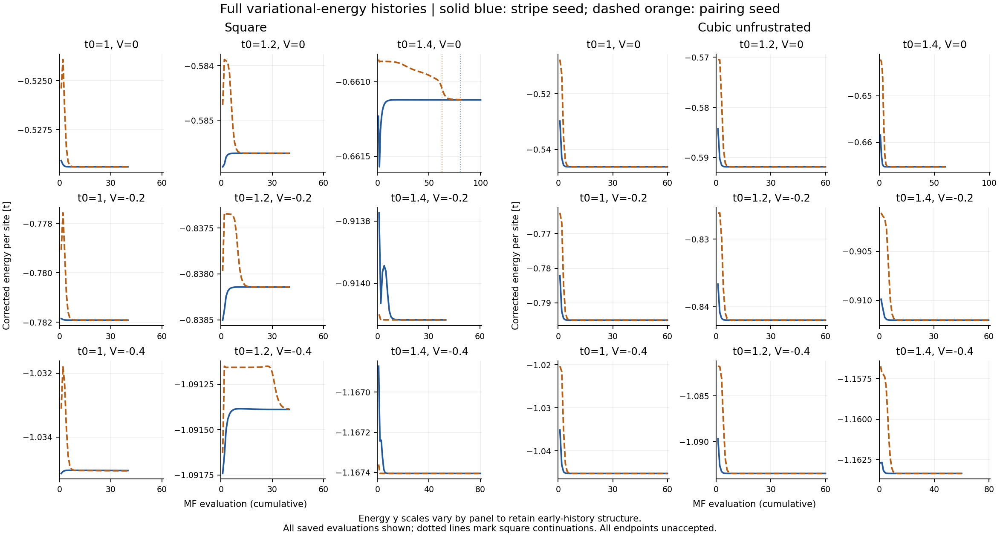
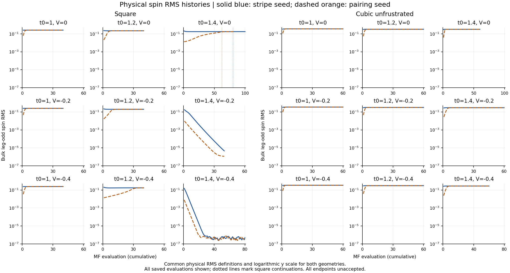
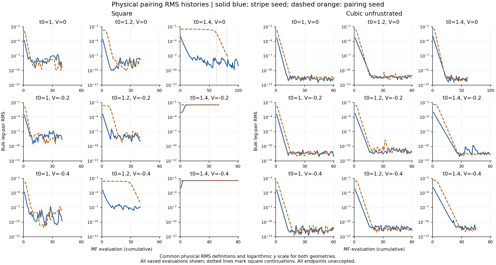
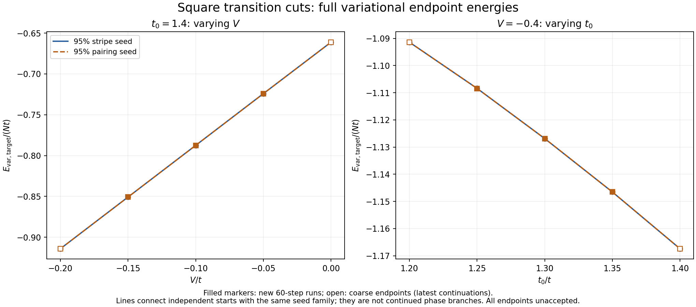
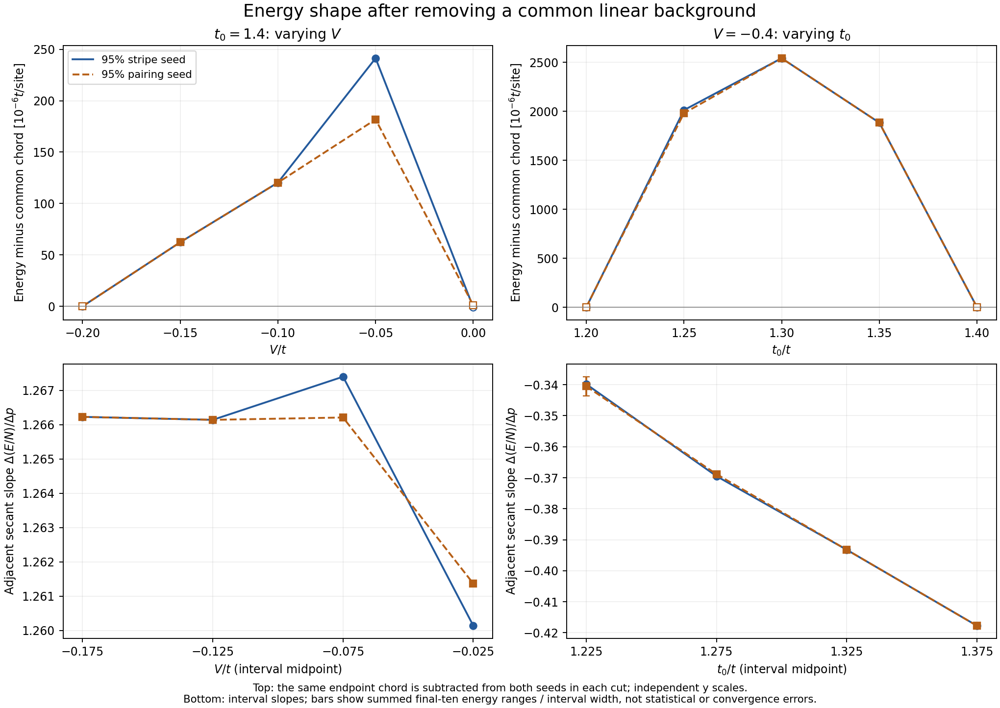
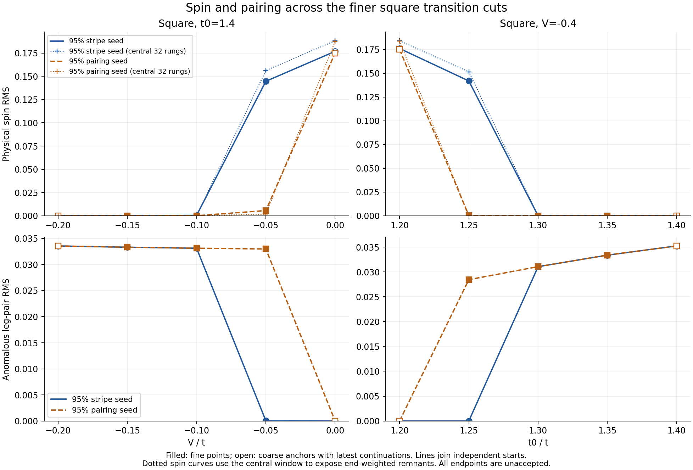

# Stripe–pairing competition across square, cubic and trellis geometries

**Updated 20 September 2026 — completed results and common-cell trellis energy check.**

The completed data distinguish geometry from the imposed spatial cell.
Cubic unfrustrated reaches stripes throughout its 3×3 grid; square retains
a paired corner and two seed-dependent coordinates on the finer cuts.
All four positive-V square starts lose pairing. In trellis, both one-ladder
seeds remain paired, while both two-ladder seeds develop stripes with large
alternating relaxation. The latter qualifies the earlier one-run conclusion.

This report covers **38 completed runs, 2280 cell updates and 2400 individual
ladder solves**, all at chi=200 and all unaccepted at their 60-step caps.
The earlier coarse square grid remains a separate reference. Qualitative
order and convergence are recorded separately; no simulation control,
acceptance flag or immutable state was changed.

| Campaign | Complete runs | Observed outcome | Remaining limitation |
|---|---:|---|---|
| Cubic unfrustrated 3×3 | 18/18 | Both seeds stripe at every point | Spatial fixed-point gates fail |
| Six finer square points | 12/12 | Four paired from both seeds; two retain distinct textures | Transition order and accepted crossing unresolved |
| Square (1.2,+0.2) | 4/4 | All lose pairing; period-eight seed leaves magnetic defects | Spatial drift; no accepted energy ranking |
| Trellis (1.0,0.0) | 4/4 | One-ladder paired; two-ladder striped from both seeds; lower striped trial energy in the same cell | Large alternating relaxation; transverse period and stationary minimum unresolved |

## 1. Cubic removes the paired corner seen on square

**Figure 1.** Square (left) and cubic unfrustrated (right), with identical
coordinate axes. Both seeds agree on the observed phase family at each point;
all endpoints remain unaccepted. S denotes CDW/SDW stripes, D pairing with
opposite leg/rung signs. No boundary is interpolated.

Both seeds reach CDW/SDW stripes at every t0=1.0, 1.2, 1.4 and
V=0, −0.2, −0.4 coordinate. Physical spin RMS is 0.280–0.356, while the
largest leg-pair RMS across all 18 endpoints is only 2.21e−11. Dominant
charge/spin modes remain m=4/30, corresponding to nominal 16-rung charge
and 32-rung spin-envelope periods.

The contrast in **Figure 1** is sharp at **(1.4,−0.4) and (1.4,−0.2)**: both were paired
from both seeds in the [square grid, including its continuations](../two_basin_grid_20260915/README.md),
but both are stripe-like in cubic. This is not an artifact of measuring
larger Hartree fields: the comparison uses physical correlations. The
different transverse kernel changes basin access and the observed phase
pattern. It does not prove that no other cubic paired basin exists.

All cubic energy windows pass; their final-ten ranges are below 1.76e−8
t/site. Nonacceptance concerns remaining field/profile drift or slow-mode
checks. The near-identical endpoint energies support agreement between
the observed trajectories without making them accepted solutions.

**Figure 2.** Full target-density-corrected canonical energy histories, square
left and cubic right. Every saved evaluation is included. Columns within each
geometry have t0=1.0, 1.2, 1.4; rows have V=0, −0.2, −0.4. Solid blue and
dashed orange denote stripe and pairing seeds. Dotted lines mark the square
continuations after evaluations 80 and 62. Energy y scales vary by panel to
preserve the structure of the trajectories. Matching coordinates share their
iteration range; each curve stops at its own last saved evaluation.

**Figure 2** shows why the complete histories matter: square (1.2,−0.4)
has an extended pairing-seed energy plateau before its late decrease, and
square (1.4,0) retains a long transient into the continuation. Cubic energy
histories generally settle much earlier. Early energy dips are off-self-consistent
diagnostics, and flat energy alone does not certify a stationary texture.
The juxtaposition compares trajectories under different geometries, not their
absolute energies as competing phases of one Hamiltonian.

**Figure 3.** Physical leg-odd spin RMS on rungs 6–59, using a common logarithmic
y scale across both geometries. Colors, coordinate order and continuation
markers match Figure 2.

In **Figure 3**, square spin decays strongly at (1.4,−0.4) and (1.4,−0.2),
whereas cubic retains strong spin at both points. The square (1.4,0)
pairing-seed spin instead grows over a long interval. This distinguishes a
paired plateau from a slowly developing stripe, even when energy looks flat.

**Figure 4.** Physical leg-pair RMS on bonds 6–58, with a common logarithmic
y scale. These are correlation amplitudes, using the same bulk window in
both geometries; the older standalone square RMS figures use MF fields.

**Figure 4** shows pairing surviving at the two square paired coordinates,
while it decays to tiny numerical remnants everywhere in cubic. At square
(1.2,−0.4) and (1.4,0), its delayed collapse accompanies the spin growth in
Figure 3 and the late energy evolution in Figure 2. Small fluctuations after
pairing reaches negligible values are not evidence of renewed pairing order.

The four comparisons reuse the audited 36 lineages: 902 square and 1080
cubic evaluations. [Plotted histories](square_cubic_histories.csv) and
[source hashes and normalization](square_cubic_comparison_sources.json) are
included. PDF versions have the same figure filenames. Regenerate with
`python scripts/analyze_two_basin_campaigns_20260918.py --geometry-comparison-only`
from the ladder subproject.

[Detailed cubic analysis, full/late energy grids, spin/pairing histories and data](../cubic_two_basin_grid_20260918/README.md).

## 2. Finer square cuts identify two points with competing trajectories

**Figure 5.** Full variational endpoint energies along the two finer cuts,
including coarse anchors and the latest square continuations.

The full target-density-corrected canonical energies in **Figure 5** include the new fine
points and the coarse endpoints, with the latest V=0 continuations. **The V
cut is almost linear; the t0 cut has gradual curvature.** Both seed curves
nearly overlap on the full energy scale. They connect independent starts,
not one fixed phase continued through parameter space.

**Figure 6.** The same energies after common chord subtraction (top) and
adjacent-interval secants (bottom); bars diagnose recent energy drift.

Subtracting one common straight chord per cut in **Figure 6** reveals a small bend between
V=−0.05 and 0. The pairing-seed interval slope falls from approximately
1.2662 to 1.2614, a 0.38% change. This is compatible with a weak first-order
kink, but five samples cannot distinguish a derivative jump from smooth
curvature. The t0 slopes vary nearly regularly, with no obvious sharp cusp.
The broad arch there after linear subtraction is not a measured singularity.
All energies include the implemented MF double-counting terms; they are not
effective-Hamiltonian eigenvalues or seed-energy gaps. Recent-drift bars are
diagnostics rather than convergence error bounds. [Exact energies, slopes,
normalization and interpretation](../square_fine_cuts_20260918/README.md#full-variational-energies-across-the-transition).

**Figure 7.** Physical spin and anomalous leg-pair RMS on linear scales,
using matched definitions for all twenty coarse/fine endpoints. Open symbols
denote coarse anchors; dotted spin curves use the central 32 rungs.
A [logarithmic companion](../square_fine_cuts_20260918/order_parameter_cuts_log.png)
resolves small remainders. Connecting independent starts does not measure hysteresis.

In **Figure 7**, along **t0=1.4**, both seeds are paired at V=−0.15 and −0.10. They remain
different at **V=−0.05**: the stripe seed has spin RMS 0.1447 and leg-pair
RMS 3.67e−5; the pairing seed has leg-pair RMS 0.03299 and much weaker spin.
At the earlier V=0 point, both eventually reach stripes.

Along **V=−0.4**, the earlier t0=1.2 runs reach stripes, **t0=1.25** retains
a stripe from one seed and a paired state from the other, and both seeds
are paired at t0=1.30 and 1.35. The paired t0=1.25 spin remainder is still
decaying rapidly, by 52% over the final ten evaluations. The residual spin
at (1.4,−0.10) decays similarly, rather than reproducing the old V=0 growth.

The signed endpoint differences E(pairing seed)−E(stripe seed) are
**−3.19e−5 t/site at (1.25,−0.4)** and **−5.95e−5 at (1.4,−0.05)**.
They substantially exceed the sums of the respective final-ten energy
ranges, 1.57e−7 and 7.46e−8. This makes the distinction worth pursuing,
but these are diagnostic endpoint gaps, not accepted energetic winners.
Recent energy drift is not a bound on remaining convergence or finite-chi
error.

There is a spatial qualification at (1.4,−0.05), shown in **Figure 8**. The paired
trajectory's usual spin RMS grows 1.50% in its last ten records, yet **96.7%
of its spin-squared weight is in the outer 14 rungs at each end**. Central
32-rung spin still decreases. This is not established bulk coexistence or
a demonstrated return to a bulk stripe state.

**Figure 8.** Bulk-window histories and spatial profiles distinguish the
end-weighted spin remainder from persistent central spin. This is the spatial
qualification to the weak-spin paired endpoint discussed above.

The persistent branch contrast is compatible with metastability near a
first-order transition and makes its order interesting to determine.
It is not proof: there is no accepted energy crossing, these independent
starts do not measure parameter-sweep hysteresis, and slow relaxation or
a narrow coexistence regime remains possible. All six E_p values use the
requested linear interpolation; the earlier bare-ladder check suggests
greater interpolation sensitivity along t0 than along V. A precise
transition location should retain that limitation.

[Detailed cut analysis, spatial comparisons, complete energy histories and data](../square_fine_cuts_20260918/README.md).

## 3. All positive-V square seeds lose pairing

**Figure 9.** Full energy and order histories, with late energy detail, at
(t0,V)=(1.2,+0.2). The intertwined period-eight state is now included.

The stripe, pairing and intertwined period-16 starts end with spin RMS
0.23321–0.23358 and leg pairing below 8.3e−10. The period-eight start also
loses pairing, reaching 7.01e−9 after a further 87.8% decrease over its last
ten evaluations. No tested seed sustains appreciable anomalous coexistence.

**Figure 10.** The period-eight start retains a distinct magnetic defect
texture despite losing pairing. Pairing panels use a tiny 1e−7 scale.

The other three starts have four spin-envelope nodes near rungs 10, 25, 40
and 55. The period-eight start evolves from eight to six nodes, with two
close node pairs around the inner hole-rich regions. Its charge has dominant
m=4, while its spin spectrum mixes m=31,30,28; it has not retained a clean
shorter charge wavelength. This is consistent with incomplete coarsening or
trapped magnetic defects, not a demonstrated stationary metastable phase.

Its corrected endpoint energy is −0.332811625875 t/site, **9.3242e−4 above
the stripe-seeded endpoint**. That diagnostic gap exceeds recent energy
drift, which does not bound remaining convergence error. All four retain
global and spatial gate failures; maximum pointwise spin changes over the
final ten evaluations are 0.00358–0.00655 despite nearly constant RMS.

This completed test does not reproduce legacy frustrated-cubic intertwining
on square. Repulsive V is not by itself sufficient in this tested setup.
Other basins and parameters remain open, as do connected pair correlations
after anomalous order has vanished.

[Four-seed analysis, exact energies, nodes, gates and sources](../square_positive_v_20260918/README.md).

## 4. Trellis distinguishes the skew one-ladder and rectangular two-ladder cells

**Figure 11.** Both seeds in each trellis cell at (t0,V)=(1,0),
tau0=tau1=0.1. A/B are spatial ladders. Energy is normalized by 128 sites
for the one-ladder cell and 256 for the two-ladder cell.

Both one-ladder seeds reach nearly identical pairing: leg-pair RMS about
**0.017969**, opposite leg/rung mean signs **+0.01796/−0.03292**, and spin
near **1.3e−5**. Their endpoint energies differ by only 1.361e−8 t/site,
and maximum full-ladder pair-profile difference is 5.68e−7. The same
qualitative paired basin is well supported, though energy, inner-DMRG and
some spatial gates still fail.

Both two-ladder seeds instead develop strong CDW/SDW: spin RMS
**0.22823–0.22876** on A/B and leg pairing at most **1.26e−8**.
The pairing start loses its order rapidly. Charge/spin bins m=4/30 retain
nominal periods 16/32.

**Figure 12.** All six spatial histories, with final and nine-sweeps-earlier
profiles. B is shifted by its physical −1/2-rung offset; raw signs are retained.

The one-ladder charge modulation is end-sensitive (central standard deviation
about 0.00157). Two-ladder charge remains strongly modulated centrally
(0.0467–0.0470), with relative A/B shifts of the charge minima and spin nodes.
The tiny one-ladder spin and two-ladder pairing panels do not establish
additional orders. All profiles use stored correlations; the square Hartree
inversion is not valid for trellis.

**Figure 13.** One- versus two-sweep measured-field differences, and spin
profiles at sweeps 58–60. Even sweeps nearly overlap; the odd sweep shifts
the walls. A/B spatial labels are separate from this iteration parity.

The two-ladder result is **not merely missing an overly strict tolerance**.
Final global relative residuals are 0.1845–0.2085, versus 1e−4 required.
Final inner-DMRG windows pass. Successive full-cell field increments almost
reverse (cosines −0.99996/−0.99994), shrinking by a factor about 0.975.
Two-sweep field differences are only 3.22/3.47% of one-sweep differences but
remain resolved. This is consistent with a slowly damped alternating
transient, not an accepted orbit or physical dynamics. Modest linear damping
could be a future targeted numerical test; no such change is made here.

The two-ladder stripe/pairing endpoint energies are −0.521125816792 and
−0.521055560230 t/site. Their gap, 7.026e−5, is less than the summed final-ten
energy ranges 3.445e−4. A **September 20 audit** evaluates two copies of
each saved paired ladder in the same rectangular functional. The embedding
raises the paired energies by only 2.46378e−6 t/site; both striped trials
remain **0.002238–0.002308 t/site lower**. Density corrections below 8.33e−6
do not change that ordering. This establishes lower striped trial energies
without requiring stationarity or nested ansatz families. Large residuals
still prevent calling the endpoints optimized stationary phase minima.
[Energy components, source hashes and reproduction](../trellis_progress_20260918/README.md).

Thus the earlier contrast “trellis pairs, square/cubic stripe” applies to
the **skew one-ladder ansatz**. Allowing independent A/B profiles also accesses
stripes with a verified trial-energy advantage. The preferred transverse
arrangement remains open: A/B repetition alternates the observed 126–131-degree
charge phase advance and cannot freely continue a diagonal tilt. Larger
cells must accommodate both charge and spin under the proposed translation.
[Physical interpretation and commensurability](../trellis_progress_20260918/TRANSVERSE_INTERPRETATION_20260920.md).

[Complete trellis analysis, gate failures, profiles and relaxation data](../trellis_progress_20260918/README.md).

## Cost, evidence and the next scientific decision

The newly synced ledger contains completed-job accounting for all 38 jobs:

| Campaign | Cell updates | Ladder solves | Solver-only node-hours | Actual node-hours |
|---|---:|---:|---:|---:|
| Cubic grid | 1080 | 1080 | 13.886995 | 14.196667 |
| Finer square cuts | 720 | 720 | 13.030485 | 13.274722 |
| Positive-V square | 240 | 240 | 4.523293 | 4.602431 |
| Trellis | 240 | 360 | 8.627653 | 8.708542 |
| **Total** | **2280** | **2400** | **40.068427** | **40.782361** |

Actual costs use synchronized sacct reconciliations, elapsed seconds and
the recorded node fraction. Solver time excludes allocation overhead.
The earlier coarse square grid separately has 902 evaluations and 27.350764
actual node-hours; it is not counted again here. [Job-level accounting and
ledger hash](completion_accounting.json) supersede the September 18
incomplete accounting coverage.

Source hashes, seed/config provenance, matching within-cell fingerprints,
raw-update adjacency, log counts, physical profiles, canonical normalization
and channel windows were checked. The cut figure uses the same twenty
hashed endpoints as the energy curves and consistent physical RMS definitions.
All original state files, gates and ledgers were read-only.

The actual [manuscript LaTeX/PDF](../../manuscript/README.md) now separates
Section 3.11 (positive-V square) and Section 3.12 (trellis), with referenced
history/profile/relaxation figures and physical spin/pairing cuts in Section
3.10. The methods and literature-review project notes are updated too; no
fresh literature search is implied.

The correlation workflow is prepared for all 56 latest branches / 58 MPSs,
including unaccepted maximum-iteration states. These reports still use
anomalous amplitudes, not newly measured connected pair–pair functions.
A useful next comparison is local pair correlations in the paired and
striped endpoints with their residuals attached. Selective convergence
tests for the square boundary and two-ladder trellis remain future decisions.
No new jobs, thresholds or remote operations are prepared or executed here.
