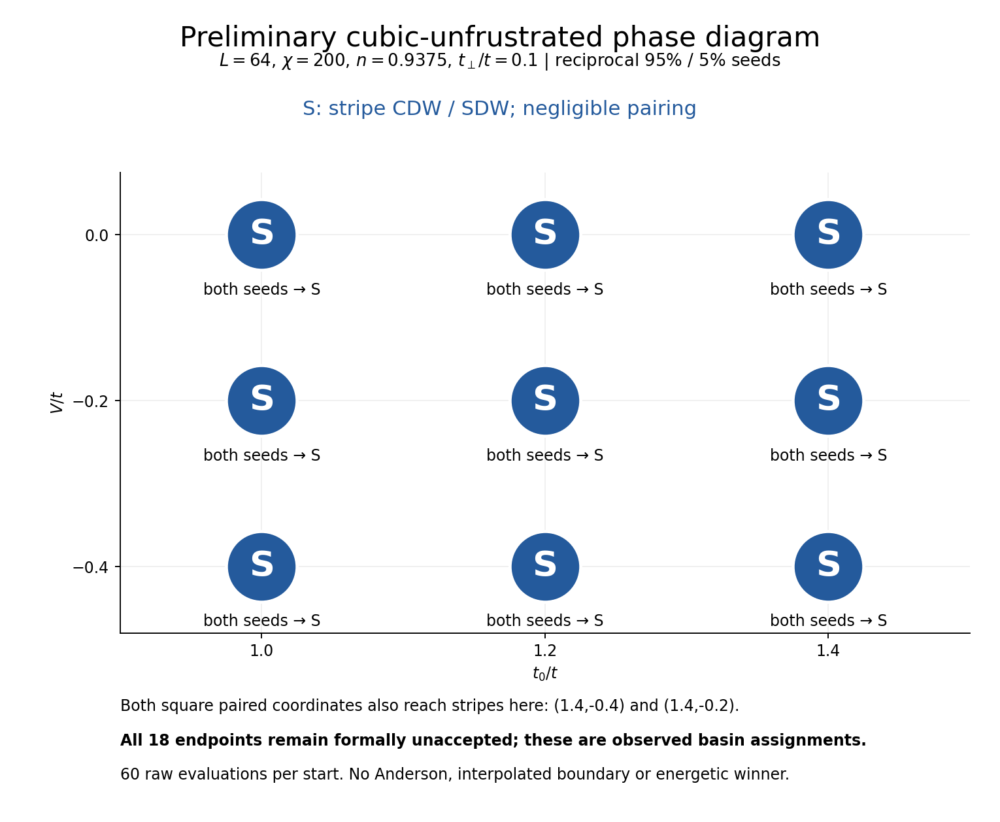
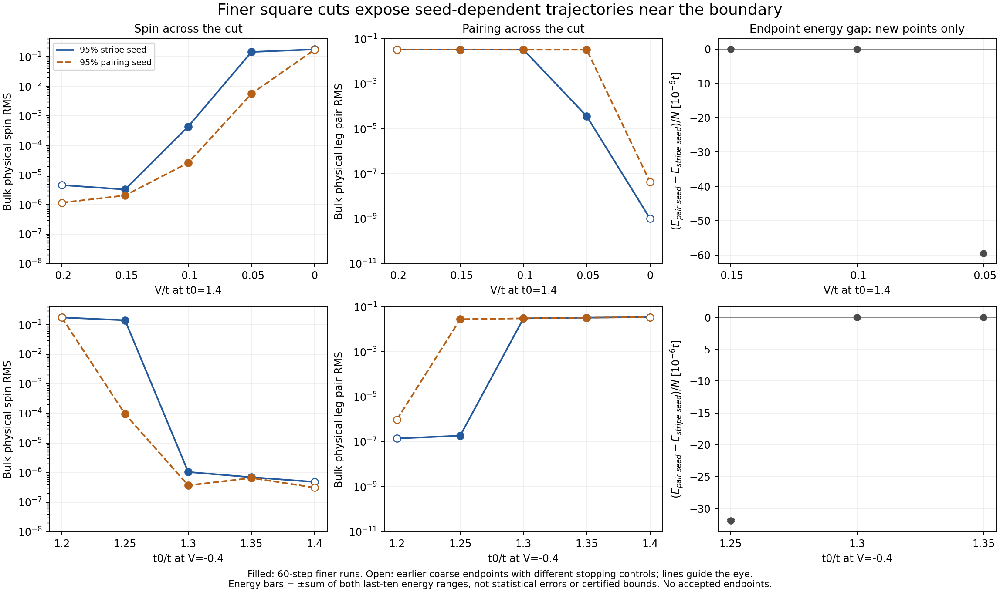
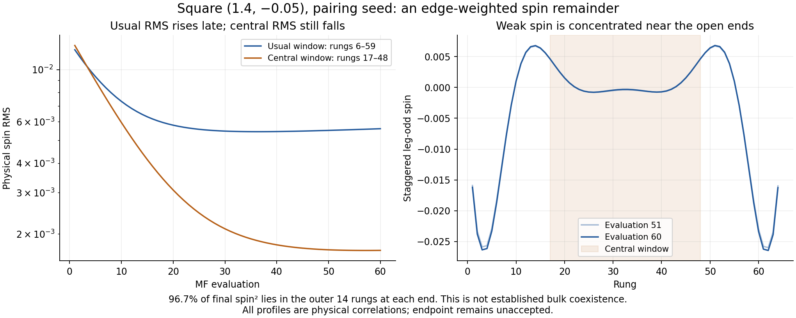
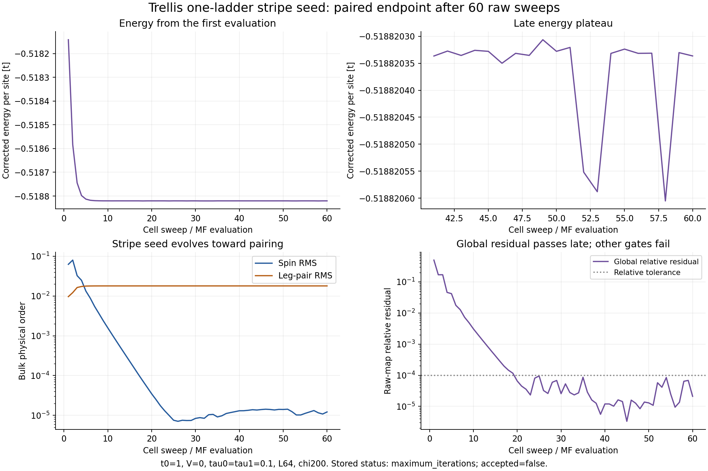

# Stripe–pairing competition across square, cubic and trellis geometries

**18 September 2026 — analysis of user-synchronized local results.**

The new data strengthen the geometry dependence of the phase picture.
Cubic unfrustrated reaches stripes throughout the 3×3 grid, while the finer
square cuts reveal two coordinates with distinct seed-dependent textures.
The completed positive-V square runs lose pairing, and the first completed
trellis run does the opposite: it loses its seeded stripe order and develops
robust pairing.

This report brings those four findings together. The 34 completed histories
reviewed here contain **2040 MF evaluations**, all at chi=200 and all
formally unaccepted after their 60-step cap. Qualitative basin identification
is often clear; accepted energetic phase selection remains unfinished.
Earlier square-grid results are used as reference, not counted again in
these totals. No tolerance, acceptance flag or simulation artifact changed.

| Campaign | Complete histories | Observed outcome | Remaining limitation |
|---|---:|---|---|
| Cubic unfrustrated 3×3 | 18/18 | Both seeds stripe at all nine points | Spatial fixed-point gates still fail |
| Six finer square points | 12/12 | Four paired from both seeds; two retain distinct textures | Transition order and accepted energy crossing unresolved |
| Square (1.2,+0.2) | 3/4 | All three lose pairing and reach stripes | Period-eight intertwined seed has only 46 complete log records |
| Trellis (1.0,0.0) | 1/4 | One-ladder stripe seed becomes paired | Other seed/cell comparisons have partial logs only |

## 1. Cubic removes the paired corner seen on square

Both seeds reach CDW/SDW stripes at every t0=1.0, 1.2, 1.4 and
V=0, −0.2, −0.4 coordinate. Physical spin RMS is 0.280–0.356, while the
largest leg-pair RMS across all 18 endpoints is only 2.21e−11. Dominant
charge/spin modes remain m=4/30, corresponding to nominal 16-rung charge
and 32-rung spin-envelope periods.

The contrast is sharp at **(1.4,−0.4) and (1.4,−0.2)**: both were paired
from both seeds in the [square grid, including its continuations](../two_basin_grid_20260915/README.md),
but both are stripe-like in cubic. This is not an artifact of measuring
larger Hartree fields: the comparison uses physical correlations. The
different transverse kernel changes basin access and the observed phase
pattern. It does not prove that no other cubic paired basin exists.

All cubic energy windows pass; their final-ten ranges are below 1.76e−8
t/site. Nonacceptance concerns remaining field/profile drift or slow-mode
checks. The near-identical endpoint energies support agreement between
the observed trajectories without making them accepted solutions.

[Detailed cubic analysis, full/late energy grids, spin/pairing histories and data](../cubic_two_basin_grid_20260918/README.md).

## 2. Finer square cuts identify two points with competing trajectories

Along **t0=1.4**, both seeds are paired at V=−0.15 and −0.10. They remain
different at **V=−0.05**: the stripe seed has spin RMS 0.1447 and leg-pair
RMS 3.67e−5; the pairing seed has leg-pair RMS 0.03299 and much weaker spin.
At the earlier V=0 point, both eventually reach stripes.

Along **V=−0.4**, the earlier t0=1.2 runs reach stripes, **t0=1.25** retains
a stripe from one seed and a paired state from the other, and both seeds
are paired at t0=1.30 and 1.35. The paired t0=1.25 spin remainder is still
decaying rapidly, by 52% over the final ten evaluations. The residual spin
at (1.4,−0.10) decays similarly, rather than reproducing the old V=0 growth.

The signed endpoint differences E(pairing seed)−E(stripe seed) are
**−3.19e−5 t/site at (1.25,−0.4)** and **−5.95e−5 at (1.4,−0.05)**.
They substantially exceed the sums of the respective final-ten energy
ranges, 1.57e−7 and 7.46e−8. This makes the distinction worth pursuing,
but these are diagnostic endpoint gaps, not accepted energetic winners.
Recent energy drift is not a bound on remaining convergence or finite-chi
error.

There is an important spatial qualification at (1.4,−0.05). The paired
trajectory's usual spin RMS grows 1.50% in its last ten records, yet **96.7%
of its spin-squared weight is in the outer 14 rungs at each end**. Central
32-rung spin still decreases. This is not established bulk coexistence or
a demonstrated return to a bulk stripe state.

The persistent branch contrast is compatible with metastability near a
first-order transition and makes its order interesting to determine.
It is not proof: there is no accepted energy crossing, these independent
starts do not measure parameter-sweep hysteresis, and slow relaxation or
a narrow coexistence regime remains possible. All six E_p values use the
requested linear interpolation; the earlier bare-ladder check suggests
greater interpolation sensitivity along t0 than along V. A precise
transition location should retain that limitation.

[Detailed cut analysis, spatial comparisons, complete energy histories and data](../square_fine_cuts_20260918/README.md).

## 3. Positive V has not produced intertwined order on square so far

At **(1.2,+0.2)**, the stripe, pairing and intertwined period-16 starts
all finish with spin RMS about **0.233** and leg pairing below **8.3e−10**.
The deliberately intertwined seed loses its pairing too. All three have
the same nominal 16-rung charge/32-rung spin-envelope wavelength; a global
spin reversal of one seed is a symmetry choice, not another phase.

The outstanding **period-eight intertwined seed** has 46 complete stdout
records but no synced state/checkpoint. Its latest global relative residual
is 1.046e−3 and its corrected energy is −0.332811523 t/site, versus roughly
−0.333744 for the three completed trajectories. Without its profiles we
cannot tell whether its shorter wavelength or pairing persists.

Thus the available square evidence does **not** support a general rule
that repulsive V produces intertwining. The legacy result remains specific
to its geometry and tested states. One wavelength test is still missing,
and none of these observations excludes other basins or numerical limits.

[Positive-V history/profile figures, convergence details and partial log](../square_positive_v_20260918/README.md).

## 4. Trellis already gives a qualitatively different outcome

The completed **one-ladder, stripe-dominated trellis start** at t0=1, V=0,
tau0=tau1=0.1 converts toward pairing. Spin RMS falls from **0.0627 to
1.21e−5**, while leg-pair RMS rises from **0.00965 to 0.01797**. Final
mean leg/rung amplitudes have opposite signs, **+0.01796/−0.03292**.
The pair profile is nearly stationary over the last ten evaluations.
End-dependent charge oscillations remain; they do not demonstrate bulk
intertwined order.

Square and cubic at the same bare-ladder coordinate instead reach stripes.
That contrast is interesting now, even before the other trellis jobs finish.
It concerns geometry-dependent trajectories, not a comparison of energies
between different Hamiltonians.

The global relative residual passes late, but the trellis run still misses
inner-DMRG, energy-window and several channel/profile gates. Its last-ten
energy range is 2.84e−7 t/site; the endpoint energy is −0.518820336467.
The other one-ladder seed has a very similar logged energy after 21 sweeps,
but no synced profile. The two-ladder stripe/pairing logs contain 18/1
complete cell sweeps. Their cell outcomes and energetics remain unresolved.

[Trellis profiles, raw-correlation analysis, gate failures and partial logs](../trellis_progress_20260918/README.md).

## Cost, evidence and the next scientific decision

| Completed histories reviewed here | MF evaluations | Solver-only fractional node-hours | Actual allocation evidence in sync |
|---|---:|---:|---|
| Cubic grid | 1080 | 13.886995 | 9.441597 node-hours for 12 of 18 jobs |
| Finer square cuts | 720 | 13.030485 | Unavailable |
| Positive-V square, three complete | 180 | 3.027065 | Unavailable |
| Trellis, one complete | 60 | 1.986804 | Unavailable |
| **Total completed subset** | **2040** | **31.931350** | **Incomplete; no exact overall allocation total** |

Solver totals use recorded solver seconds × one quarter node and exclude
allocation overhead. Partial-job costs are excluded. The original coarse
square grid, including its continuations, separately has 902 evaluations
and 27.350764 actual node-hours; it is not added to this table.

The audit checked source hashes, seed/config provenance, compatible
fingerprints within each comparison, raw-update adjacency, log counts,
physical order parameters, canonical energy correction and channel windows.
Trellis profiles come directly from correlation histories because its fields
cannot be inverted using the square/cubic density formula. Each detailed
report includes source inventories, machine-readable histories and figures.
All analysis was local; no new simulation, remote query, submission, artifact
mutation or accounting-ledger edit occurred.

The most useful next evidence is the remaining period-eight square state
and the other trellis states. After those arrive, the two split square
coordinates are natural candidates for selective convergence/stability
work before deciding the order of the transition. Higher chi, length and
interpolation studies remain deferred, as requested. This report prepares
no new compute or tolerance changes.
