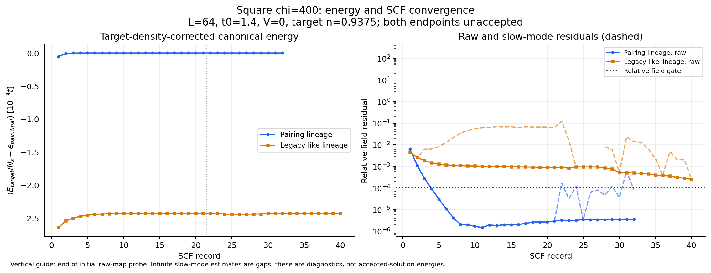
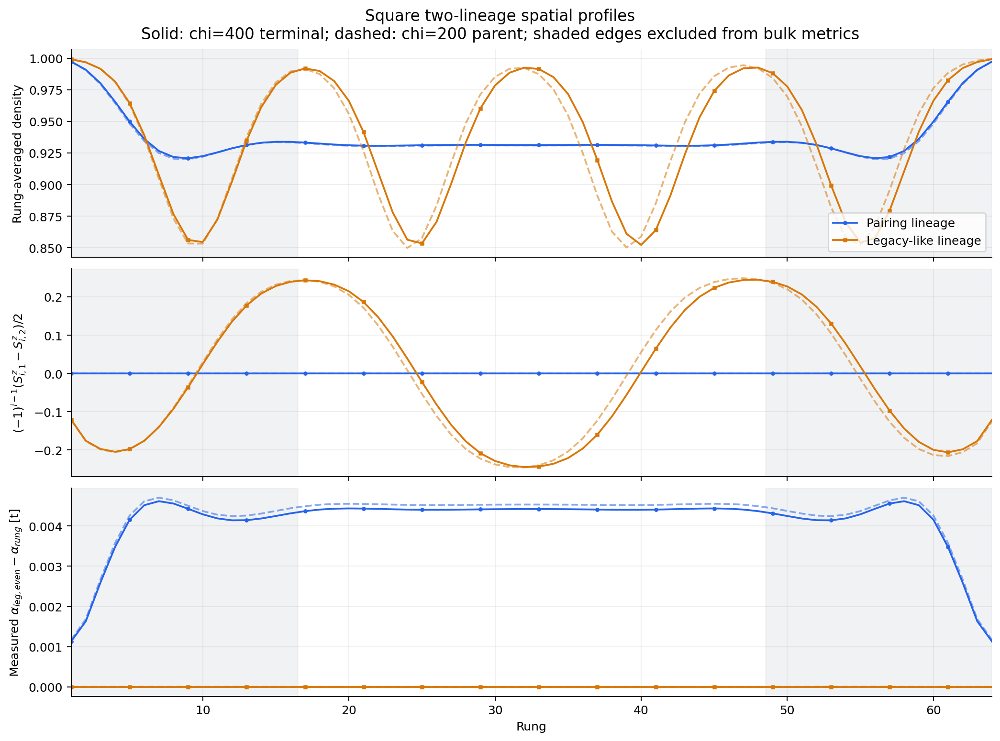

# Square chi=400 pairing / stripe comparison

Local analysis: September 5, 2026 (America/Los_Angeles). Source summaries were
written September 5 at 23:51 UTC and September 6 at 01:31 UTC.

**September 6 interpretation update:** the user considers the paired
Hamiltonian-identity discrepancy negligible for this energetic comparison and
treats that endpoint as converged. The stripe's downward residual and early
energy plateau are considered sufficient evidence that the energy advantage
is reasonably robust over the tested chi=200 to 400 increase. Work proceeds
to the [L=96/128 seed review](../finite_size_seeds_20260906/README.md).
The numerical evidence and original solver acceptance flags below are retained
unchanged; further bond-dimension scaling remains possible future work.

**The legacy-like striped endpoint has a lower diagnostic energy by
0.03115024 t for the 128-site ladder, or 2.43361262e-4 t per physical site.
The two lineages remain very different. Neither endpoint is an accepted SCF
fixed point, so a formal fixed-point energy ranking remains incomplete.**

The jobs have finished executing; this is distinct from scientific acceptance.
The comparison is square, L=64, U=8, V=0, t0=1.4, tp=0.1, target n=0.9375,
chi=400, r_range=4, exact signed E_p=-0.14653773091916378. The stored model,
numerical, implementation, full-tree, GPU Manifest, E_p-registry and scalar
fingerprints match between the two endpoints.

## Energy evidence

These are **terminal diagnostic values**, not accepted solution energies.
Both stored solution-energy fields are NaN. No accepted-only ranker was used.

| Quantity | Pairing lineage | Legacy-like stripe lineage |
|---|---:|---:|
| Job ID | 57905744 | 57905745 |
| Terminal classification | stagnated; unaccepted | time_limit; unaccepted |
| SCF records | 32 | 40 |
| Canonical E, t | -84.5955973871 | -84.6275072244 |
| Target-density-corrected E, t | -84.5963569761 | -84.6275072176 |
| Corrected E / physical site, t | -0.660909038876 | -0.661152400138 |
| Applied density correction / site, t | -5.93428904e-6 | +5.27484130e-11 |
| Absolute density error | 3.58026627e-6 | 3.21904725e-11 |
| Last energy step / site, t | 1.62370417e-9 | 1.63558765e-8 |
| Last ten records: energy range / site, t | 1.63276836e-9 | 7.00678663e-7 |

The calculation uses the stored direct canonical functional, including the
transverse mean-field and double-counting terms. Its density correction is
`mu * (N_target - N)`, with N_target=120 and N_s=128. This correction was
independently reconstructed from the measured spin-resolved densities. The
effective-Hamiltonian DMRG eigenvalues must not be used for branch competition.

The energy separation is about **347 times** the sum of the two last-ten-record
ranges (7.02311e-7 t/site). The stripe energy remains below the pairing endpoint
throughout the recorded trajectory; the displayed histories show no approach
to an energy crossing. This supports a substantial provisional energetic
preference for the stripe within these calculations. A recent history range
is not a bound on the energy of an eventual fixed point or on finite-chi error.
The signed density correction has already been applied; its magnitude is not
the remaining density error in energy.

## What supplies the stripe energy gain

All differences below are stripe minus pairing, in t per physical site.
Negative values favor the stripe. The spin and charge rows split the stored
spin-resolved Hartree transverse term; they are not added again as a separate
Hartree subtotal.

| Contribution | Difference |
|---|---:|
| Bare ladder | +0.003478293064 |
| Transverse pairing | +0.000278802167 |
| Transverse normal exchange | +0.000145578626 |
| Transverse Hartree: charge component | +0.000075203047 |
| Transverse Hartree: spin component | -0.004227172507 |
| Target-density correction | +0.000005934342 |
| **Total corrected difference** | **-0.000243361262** |

The stripe pays a bare-ladder cost and loses the pairing contribution, but its
spin-dependent transverse Hartree gain more than compensates. In particular,
the favorable stored `density_transverse_energy` should not be interpreted as
a charge-only gain: its spin part is responsible for the favorable balance.
The net separation is a difference of larger terms, which makes matched
bond-dimension checks important before claiming an asymptotic energy ordering.

## Why acceptance failed

| Final diagnostic | Pairing | Stripe | Configured limit |
|---|---:|---:|---:|
| Raw absolute field residual | 2.70749e-7 | 2.58868e-5 | 1e-7, OR relative gate |
| Raw relative field residual | 3.59437e-6 | 2.49005e-4 | 1e-4 |
| Slow-mode extrapolated relative residual | 8.25186e-5 | 2.49005e-4 | 1e-4 |
| Hamiltonian identity error / site | 2.68869e-10 | 2.94056e-11 | 1e-10 |
| Effective eigenvalue/expectation error / site | 1.03473e-13 | 1.55431e-14 | 1e-8 |
| Last DMRG sweep energy change, total t | 2.17364e-9 | 4.29925e-8 | 1e-9 |
| Sweeps in last solve | 16 | 12 (deadline) | up to 16 |
| Last-sweep maximum discarded weight | 1.19241e-6 | 6.20582e-7 | diagnostic |
| Maximum discarded weight over last solve | 6.35282e-5 | 1.59759e-4 | diagnostic |
| Realized maximum link dimension | 400 | 400 | 400 |

**Pairing:** the final raw field gate passes for the last two records, and the
final slow-mode, density, energy-stability and effective-consistency gates pass.
The Hamiltonian-identity gate fails by a factor of 2.69. The solver then reports
the stagnation stopping condition. This is a nearly stationary paired endpoint,
not evidence that pairing disappeared. The identity discrepancy is tiny
relative to the energy separation, but it cannot be silently waived or assumed
to be harmless without diagnosing its numerical origin.

**Stripe:** the relative field residual is still 2.49 times its limit, so this
endpoint has not yet reached the tight fixed-point criterion. The last density
is extremely close to target, but the density-targeted solve stopped on the
wall-time deadline. The final energy step passes the outer energy gate. The
raw relative residual fell from 8.82733e-4 at the end of the initial raw probe
to 2.49005e-4 at termination; slow-mode estimates were much larger at several
intermediate records. No credible extrapolated completion time follows from
the final two records alone.

Neither final DMRG solve meets its 1e-9 total-energy last-sweep tolerance. The
current outer acceptance does not itself enforce this inner stopping result,
as already documented in the September 4 review. Small eigenvalue/expectation
or Hamiltonian-identity discrepancies are consistency checks, not bounds on
DMRG optimization or truncation error. Both states saturate chi=400, and no
variance or matched higher-chi error bound is supplied here.

The saved classifications have period zero and solution kind `none`. The
existing offline history screen does not convert either to an accepted state;
its terminal period-two oscillation test also fails for both. There is no
accepted raw-map orbit to average or rank.

## The two spatial states survive separately

Bulk metrics below use the central half, one-based rungs 17--48. Pairing is the
existing measured-field proxy `alpha_leg_even - alpha_rung`, not a correlation
function or a thermodynamic order parameter. The spin metric is the RMS of
`(-1)^(i-1) * (Sz_leg1 - Sz_leg2)/2`.

| Bulk diagnostic | Paired chi=400 | Stripe chi=400 |
|---|---:|---:|
| Pairing-field proxy RMS, t | 0.00441635 | 6.03183e-10 |
| Rung-density peak-to-peak | 0.00255596 | 0.14027481 |
| Staggered leg-odd spin RMS | 1.65569e-6 | 0.18624224 |
| Maximum absolute site Sz | 5.48521e-6 | 0.24465266 |

The legacy-like state retains pronounced charge stripes and antiphase spin
domains with negligible anomalous field. The pairing lineage has a smooth
pairing profile and extremely weak spin polarization. They have not collapsed
to the same endpoint during this run. This is evidence of distinct persistent
trajectories at finite L and chi; it does not prove both are stable against
general perturbations, especially a finite pairing perturbation of the nearly
normal stripe branch.

Relative to their chi=200 parents, the pairing proxy RMS decreases about 2.57%
on the paired lineage. The stripe spin RMS decreases about 1.19% and its charge
peak-to-peak decreases about 2.97%; its wall positions shift slightly. The
qualitative textures survive. The respective corrected energy changes are
-4.51569e-5 and -2.34052e-5 t/site. These changes combine bond dimension, tighter
controls and SCF evolution. The stripe parent was a frozen-field diagnostic,
so neither difference is a controlled chi extrapolation or formal ranking
against a parent with a different numerical fingerprint.

## Next scientific step and the three pending campaigns

The immediate comparison needs accepted endpoints at common controls. First
diagnose the pairing identity failure using the retained full state, then
complete the stripe SCF and inner DMRG convergence. Any necessary changes to
the numerical controls should be applied to both comparison branches. A
blanket continuation of the paired branch with unchanged stopping behavior is
not established as useful by these results. Preserve the full-state lineages
and reconcile actual Perlmutter accounting before choosing further compute.
After acceptance, selected matched higher-chi checks should address whether
the provisional energy advantage survives truncation error. No solver or
launcher change, continuation preparation, or submission was made here.

The user reports these three **campaigns** remain pending. Their synchronized
`jobs.tsv` files contain 15 branch submissions, with no local terminal states:

| Campaign | Submitted branch jobs recorded locally | Pending question |
|---|---|---|
| Square smooth-pairing grid | 57908558, 57908560--57908563 (5) | Five missing grid cells |
| Cubic-unfrustrated smooth-pairing grid | 57909095--57909102 (8) | Eight missing grid cells |
| Square t0=1.4, V=-0.4 stripe/control | 57909911--57909912 (2) | Whether the inherited stripe persists as an accepted competing endpoint |

Submission records do not independently verify live scheduler status. The
grids provide loose chi=200 coverage from one access seed; they do not resolve
the present V=0 high-chi acceptance or prove basin uniqueness. The V=-0.4 test
will address a different Hamiltonian point. Its same-point energy comparison
requires two accepted, fingerprint-compatible endpoints.

## Reproduction and verification boundary

- Source campaign: `output/phase1_gpu/20260903_phase1_square_t014_v000_pairing_legacy_chi400_tight`.
- [analyze.py](analyze.py) reads all source HDF5 files without modification,
  reuses `scripts/audit_scf_numerics.py` and the existing spatial-profile
  definitions, and creates the companion CSV/JSON/PNG/PDF files.
- [compact_checks.csv](compact_checks.csv): all eight manifest artifacts
  (two terminal files, four checkpoints, two summaries) pass compact SHA-256
  and size checks. All six compact HDF5 files pass no-MPS, stateless and
  recorded-full-hash metadata checks. Config and GPU Manifest hashes match
  stored provenance; child parent hashes match the parent mirrors' recorded
  full-artifact identities. The full scratch artifacts were not inspected.
- [endpoints.csv](endpoints.csv), [history.csv](history.csv),
  [energy_decomposition.csv](energy_decomposition.csv),
  [parents.csv](parents.csv), [profiles.csv](profiles.csv), and
  [scf_audit.csv](scf_audit.csv) contain the reproducible numerical evidence.
- Local command: `python -B -X utf8 ladder_mps_mft/docs/reports/chi400_comparison_20260905/analyze.py`
  from the repository root. Extraction, assertions and figure generation took
  approximately four seconds. Both final PNGs were visually inspected.
- No Julia/DMRG solve, solver source change, scientific recertification, full-scratch
  verification, transfer, Perlmutter login, scheduler action or ledger update
  occurred. Source artifacts and existing review work were preserved.
