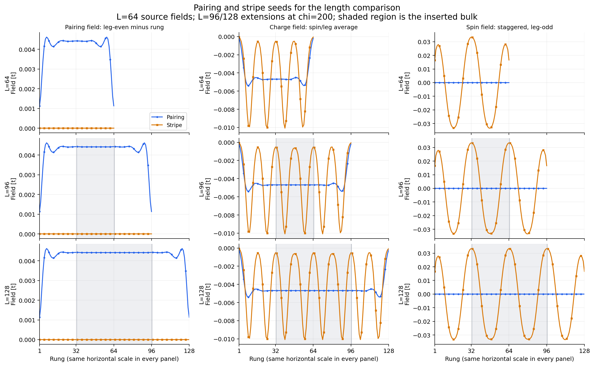

# L=96 and 128 seed review: square pairing / stripe comparison

Prepared locally September 6, 2026. Four field-only seeds and four chi=200
review configurations are ready. No scheduler campaign, reservation or
submission has been created.



Blue is the pairing lineage and orange is the stripe lineage. Columns show
the measured-field pairing proxy, spin/leg-averaged Hartree charge field, and
staggered leg-odd Hartree spin field. Rows show the L=64 reference and the
L=96/128 seeds. Every panel uses the same rung scale. Gray shading marks the
inserted bulk. These are **seed fields**, not results from longer ladders.

## Experiment

| Control | Value |
|---|---|
| Geometry / point | square; U=8, V=0, t0=1.4, tp=0.1, t=1 |
| Lengths / bond dimension | L=96 and 128; chi=200; both lineages at each length |
| Target density / particle numbers | 0.9375; N=180 and 240 |
| Pair-binding reference | Signed E_p=-0.14653773091916378 t from the existing L=64 registry row |
| Fixed effective coupling | tp^2 / abs(E_p)=0.06824181005993885 t |
| MPS initialization | Fresh product MPS at each size; RNG seed 1404 |
| Field initialization | Extended L=64 **chi=400 terminal measured fields**, with inherited chemical potential |
| DMRG controls | 16 sweeps, cutoff 1e-11, energy_tol 1e-9, chi=200 |
| Density / field controls | Density 1e-4; absolute field 1e-7 OR relative field 1e-4 |
| Energy stability / identity | 1e-7 t/site; identity threshold relaxed to 1e-8 t/site |
| SCF controls | Initial raw evaluation plus 20 unmixed updates; then existing Anderson protocol; up to 80 updates |
| Per-segment solver deadline | Existing 41,400-second setting; a scheduler request is not yet assigned |

The user explicitly selected a fixed L=64 denominator so changing L tests the
same effective coupling. There are no L=96/128 registry measurements. The new
`pair_binding.reference_L = 64` option performs an exact lookup at the named
reference length, keeps the actual model length, and records
`ep_mode=fixed_reference_length` and the reference length in provenance and
HDF5 metadata. It does not invent registry rows or relabel the denominator as
a measurement at the target size. Default same-length lookup remains unchanged.

The identity threshold change follows the user's assessment that the paired
L=64 error of 2.69e-10 t/site is sufficiently small for this energy comparison.
Other tight controls are retained in these review configurations. In
particular, raising chi is not part of this four-run proposal.

## Pairing extension

All onsite fields in the original left 32 rungs are copied exactly; the right
32 are translated intact to the new right end. Bonds wholly within either
half are also copied exactly. In the inserted middle, each retained bond
channel approaches the average of its central L=64 profile, with its
two-sublattice parity kept separate. An eight-rung quintic taper at each end
of the insertion makes the joins smooth. The middle plateau is uniform within
each sublattice. No overall amplitude rescaling is applied.

The operation extends alpha, beta and both spin-resolved Hartree fields. It
does not extend just the one plotted pairing proxy or discard the normal
fields needed to preserve the original basin.

## Stripe extension

The L=64 profile has four charge troughs, with approximately 16-rung charge
spacing and 32-rung spin-envelope period. L=96 adds one complete 32-rung spin
period; L=128 adds two. They consequently contain six and eight charge troughs.

The source's left and right halves are preserved exactly as for pairing. The
inserted waveform uses translated samples of the central source region, with
**integer shifts of 32 rungs**. This preserves the microscopic alternating
spin sign as well as the longer antiphase envelope and the phase at the right
boundary. The wavepackets are repeated at their original scale, not stretched
to fit the new length.

The central region is made periodic through an eight-rung overlap between
source centers 12.5--20.5 and 44.5--52.5. Positive quintic weights sum to one;
the actual source shapes are blended at matching envelope phases. This avoids
a hard jump at the repeated-cell boundary and cannot create an amplitude
overshoot. A perfectly periodic 32-rung source is reproduced exactly by the
construction, including its 16-rung charge harmonic.

The measured finite L=64 source is only approximately periodic: its charge
troughs are at rungs 10, 25, 40 and 55. The L=96 seed has troughs at
10, 25, 40, 57, 72 and 87; L=128 has
10, 25, 40, 57, 72, 89, 104 and 119. The 32-rung insertion therefore includes
15- and 17-rung spacings, absorbing the small phase mismatch in the smooth
overlap rather than stretching every packet. Neither the maximum charge-field
neighbor step nor the maximum staggered-spin-envelope neighbor step increases
relative to the original. The SCF evolution is free to adjust these positions.

## Bond geometry and boundary conditions

For every signed rung separation d=-4,...,4 and every spin/leg component,
extension is applied to the bond-center profile `F_d(c)`, where
`c=(i+j)/2`. It never maps i and j independently through a periodic index.
Thus relative separation, the four-rung interaction cutoff, and the open
ends are retained. Bonds crossing into the inserted region are populated
using the same rule; no link connects the two physical ends.

All onsite fields in each retained 32-rung half and all bonds inside that
half match the source exactly. In particular, all retained couplings incident
on the outermost 28 rungs at either end are unchanged. Inactive same-site beta
entries and square-geometry zero cross-leg channels remain zero. Normal
exchange fields retain their transpose symmetry. The small pre-existing
asymmetry of the measured anomalous fields is preserved rather than silently
symmetrized.

The field seed is not constrained to integrate to the target particle number.
Fixing its edge values and inserting its bulk should not be followed by a
global field rescaling. The independent chemical-potential search imposes the
requested density during the calculation.

## Files and local reproduction

From the local Windows repository root:

```powershell
python -B -X utf8 ladder_mps_mft/scripts/prepare_phase1_finite_size_seeds.py
python -B -m unittest discover -s ladder_mps_mft/test -p test_finite_size_seeds.py
julia --startup-file=no --compiled-modules=existing --project=ladder_mps_mft -L ladder_mps_mft/test/test_fixed_reference_length.jl ladder_mps_mft/scripts/verify_phase1_finite_size_seeds.jl
```

- Seeds: `output/seed_previews/20260906_square_t014_v0_L96_L128_chi200/`
  inside the ladder subproject. Four compressed HDF5 files total about 257 KiB.
- Configs: `configs/phase1_gpu_square_size_compare_chi200/`. Their output paths
  deliberately contain `UNPREPARED_SIZE_COMPARE`; scratch paths and the
  scheduler manifest are assigned at the later submission-preparation step.
- [seed_manifest.json](seed_manifest.json) records all source and derived seed
  hashes. Original terminal `state.h5` files are untouched. Re-running the
  preparer verifies existing seeds and refuses changed contents.
- [seed_profiles.csv](seed_profiles.csv) contains every plotted value;
  [stripe_profile_metrics.json](stripe_profile_metrics.json) records charge
  trough positions and step sizes; [seed_snapshot.pdf](seed_snapshot.pdf)
  provides the vector figure.
- Validation: four Python geometry tests passed; sixteen Julia reference-length
  configuration assertions and eighty-three real-seed readback assertions
  passed. The Julia loader checked exact inherited fields, array dimensions,
  source/seed hashes, same controls and same-L model fingerprints. Both lengths
  use one common numerical fingerprint. No DMRG or full expensive suite was run.

## Interpretation and submission boundary

The working interpretation, following the user's September 6 direction, is
that the L=64 paired endpoint is converged for the energetic question, and
that the stripe's falling residual and early energy plateau support an energy
advantage that is reasonably robust to the tested chi=200 to 400 increase.
Original `stagnated` / `time_limit` and `accepted=false` flags remain intact as
machine-generated provenance. They are not the reason to delay this requested
length study. Larger-chi checks remain a possible later control.

At each new L, first compare the two lineages' corrected canonical energy
difference per physical site, delta_e(L), and verify that their spatial
textures survive. Examine delta_e versus 1/L without treating three lengths
as a definitive thermodynamic extrapolation. The old L=64 chi=200 stripe
reference is a frozen-field diagnostic and its controls differ; it remains an
approximate baseline. A matched L=64 chi=200 SCF control could be added later
if needed, but is not included among the four requested runs.

The current seed preview does not authorize an automatic submission. The
fixed-reference support changes the local solver implementation fingerprint;
do not overwrite the source checkout used by the three pending Perlmutter
campaigns while they are waiting or running. The later handoff must either use
a separate source checkout for this comparison or wait until those jobs no
longer need the old checkout. This work changed no Perlmutter state, budget
ledger, existing launcher or historical artifact.
