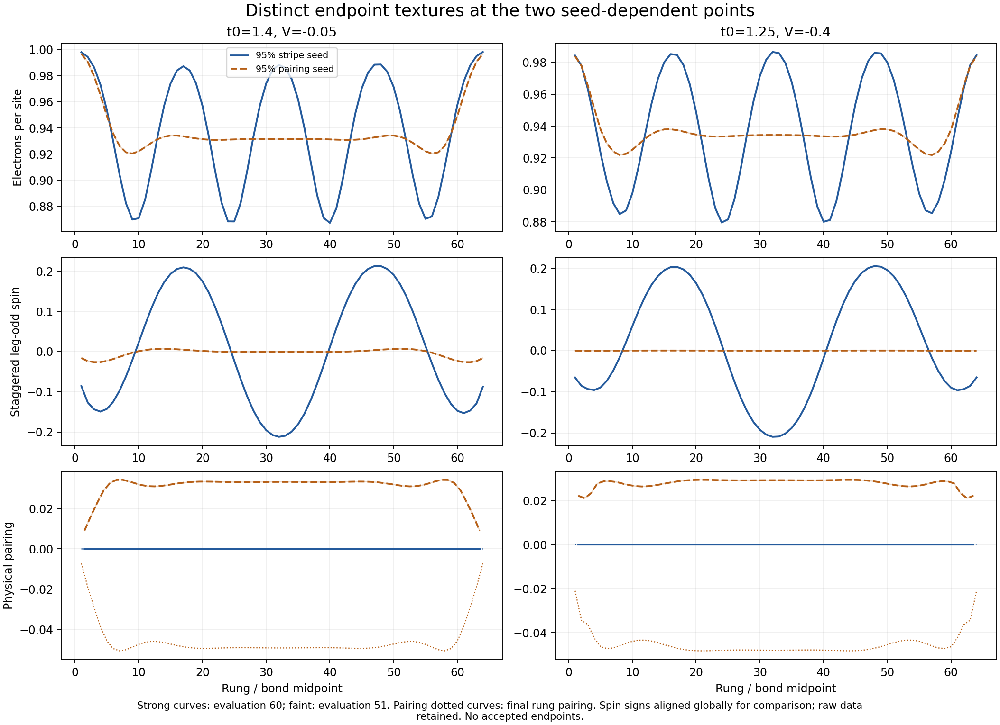

# Finer square cuts near the stripe–pairing boundary

Local synchronized snapshot, 18 September 2026. Part of the
[combined campaign review](../campaign_review_20260918/README.md).

**Two points retain distinct textures from the two seeds:** (1.25,−0.4)
and (1.4,−0.05). The other four new points reach paired trajectories from
both starts, with residual spin still decaying in one (1.4,−0.10) run.
These are useful candidate metastability points, but no endpoint is formally
accepted and the runs do not yet establish the transition's order.

## Endpoints after 60 raw evaluations

All twelve runs in `20260915_square_two_basin_fine_cuts_95_5_60` completed
their 60-evaluation cap: **720 saved evaluations**, zero accepted endpoints.
L=64, chi=200, U=8, n=0.9375, tp=0.1, reciprocal 95%/5% reference seeds,
no Anderson or damping, minimum 40 evaluations and a ten-record window.

S/P in the table denote the stripe-dominated and pairing-dominated initial
seeds. Spin is physical leg-odd RMS on rungs 6–59; pairing is physical
leg-bond RMS on bonds 6–58. D denotes pairing with opposite leg/rung signs,
not a proof of a thermodynamic superconducting phase.

| (t0,V) | Spin RMS S / P | Leg-pair RMS S / P | Observed trajectories | E(P)−E(S), t/site |
|---|---:|---:|---|---:|
| (1.4,−0.15) | 3.24e−6 / 2.03e−6 | 0.033329 / 0.033329 | Both D | +1.22e−9 |
| (1.4,−0.10) | 4.38e−4 / 2.60e−5 | 0.033139 / 0.033139 | Both paired; spin remainder decays | −5.50e−11 |
| (1.4,−0.05) | 0.144695 / 0.005606 | 3.67e−5 / 0.032991 | Stripe / paired with weak end-weighted spin | −5.95e−5 |
| (1.25,−0.4) | 0.141970 / 9.60e−5 | 1.87e−7 / 0.028445 | Stripe / D | −3.19e−5 |
| (1.30,−0.4) | 1.05e−6 / 3.70e−7 | 0.031061 / 0.031061 | Both D | −1.78e−8 |
| (1.35,−0.4) | 6.97e−7 / 6.57e−7 | 0.033383 / 0.033383 | Both D | −1.62e−9 |

Along t0=1.4, both starts are paired through V=−0.10, split at −0.05, and
are striped at the earlier V=0 endpoint. Along V=−0.4, both earlier t0=1.2
starts are striped, the new t0=1.25 starts split, and both are paired from
1.30 upward. The coarse endpoint markers in the figure have different
stopping controls; connecting lines guide the eye and are not fitted phase
boundaries.

The paired (1.25,−0.4) spin amplitude falls by 52.1% from evaluations 51
to 60. At (1.4,−0.10), spin falls by about 55% over the same interval in
both trajectories. Those remnants show continued decay rather than the
late SDW growth previously seen in the square V=0 pairing lineage.
Relative growth fits for amplitudes around 1e−6 are not treated as resolved
instabilities.

## The subtle (1.4,−0.05) paired trajectory

Its usual spin RMS bottoms out around evaluation 30 and rises slightly:
0.005523 at 51 to 0.005606 at 60, a 1.50% increase. That statistic alone
could suggest renewed stripe growth. The spatial profile gives a different
qualification: **96.7% of the final full-chain spin-squared weight lies in
the outer 14 rungs at each end**. The central 32-rung spin RMS is 0.001703
and still falls by 0.385% over the last ten records. Pairing remains 0.032991.

This is a paired trajectory with weak, strongly end-weighted spin. It does
not yet demonstrate bulk coexistence, and the late increase in the wider
window does not establish a bulk return to stripes. Full spatial profiles
are essential here. The stripe-seeded competitor has strong spin and only
3.67e−5 leg pairing, which is still falling at the endpoint.

## What the energy differences establish

At the two split points the signed endpoint gaps are −3.189e−5 t/site
(t0=1.25) and −5.952e−5 t/site (V=−0.05). The sums of the two final-ten
energy ranges are 1.574e−7 and 7.461e−8 respectively. The gaps are therefore
well resolved relative to recent energy drift, but those ranges are **not
error bars on the converged variational energies**. They do not bound
remaining field relaxation, finite-chi error, or seed-dependent transients.
The stripe t0=1.25 run also misses the energy and inner-DMRG gates.

We retain these signed diagnostics without selecting an energetic winner.
Persistent distinct branches and sizable order-parameter differences make a
first-order scenario worth testing. They do not prove it: the endpoints
are unfinished, no accepted energy crossing was measured, these independent
starts are not parameter-continuation hysteresis, and the weak spin near the
V=−0.05 boundary is not established bulk coexistence. A continuous transition
with slow relaxation is not excluded by this snapshot.

## Pair-binding interpolation and remaining qualification

All six signed E_p values match the user-requested straight-line
interpolation and recorded bracket/weight in the manifest. The V cut uses
V=−0.2 and 0 at t0=1.4; the t0 cut uses t0=1.2 and 1.4 at V=−0.4.
These are interpolated couplings, not new bare-ladder measurements.
The [earlier bare-ladder check](../two_basin_fine_cuts_20260915/README.md)
found a model-dependent interpolation sensitivity of at most 0.62% in the
coupling along V and about 5% along t0. Those checks are not uncertainty
bounds; they matter before quoting a precise boundary location.

Controls, all failed gates, density errors, last-sweep energy changes and
discarded weights are preserved in the [audit JSON](analysis.json) and
[run table](run_summary.csv). Qualitative paired/stripe assignment remains
separate from fixed-point acceptance. No thresholds were relaxed.

## Full histories, provenance and cost

- [Energy from the beginning](energy_grid.png), [late energy](energy_late_grid.png),
  [spin](spin_rms_grid.png), and [pairing](pairing_rms_grid.png); PDF versions
  use the same filenames. Energy panels retain individual y scales.
- [All iteration data](iteration_history.csv), [terminal profiles](terminal_profiles.csv),
  and [state/config hashes](sources.csv).
- Reproduction: [analysis script](../../../scripts/analyze_two_basin_campaigns_20260918.py).

The twelve completed histories contain **13.030485 solver-only fractional
node-hours**. No actual allocation reconciliation for these jobs is present
in the synced ledger; the 36-node-hour reservation is only a ceiling.
Compact/config/seed hashes, pointwise fingerprints, interpolation, raw-map
adjacency, logs, physical correlations and energy/channel calculations were
checked locally. No simulation or accounting artifact was changed.
