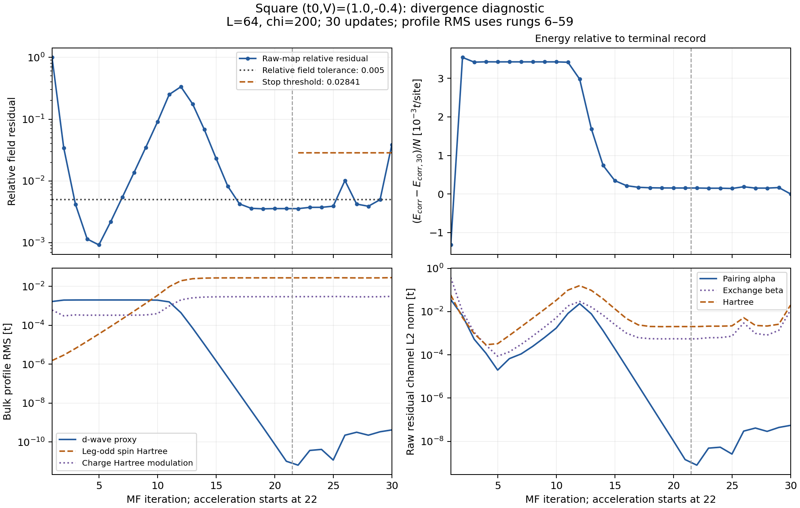
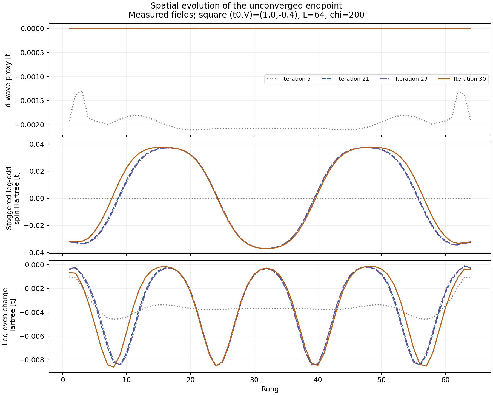

# Why the square (t0,V)=(1.0,-0.4) run stopped

The endpoint is **unconverged**, but the saved history does not show unbounded
fields. It shows pairing giving way to a stripe-like charge/spin texture during
the unmixed map, a slowly drifting plateau, and a residual spike during Anderson
acceleration. This supports an interpretation of difficult self-consistency in
the normal striped basin; it does not establish that Anderson alone caused the
underlying drift, that the basin is stable, or that a physical orbit exists.

The single-file grid includes terminal record 30 with a hatched `DIVERGING`
label. It does not substitute record 5, average iterates, or treat terminal
energy as an accepted-solution energy.

## Exact stopping condition

The run contains 30 records: initial record 1, unmixed probes 2–21, a linear
update at 22 and Anderson updates 23–30. `Convergence.jl` checks the divergence
factor against the best residual **in the trailing accelerated segment**.

| Quantity | Value |
|---|---:|
| Best accelerated relative residual, iteration 22 | 0.003551837833 |
| Configured divergence factor | 8 |
| Stop threshold | 0.02841470267 |
| Terminal relative residual, iteration 30 | 0.03824999010 |
| Terminal / best accelerated residual | 10.76907 |
| Terminal absolute residual | 0.003520466120 t |
| Required relative / absolute field tolerance | 0.005 / 1e-6 t |

This reproduces the stored stop reason exactly. The global lowest residual is
at iteration 5, but that is not the reference used by this stop test. The much
larger transient residual at iteration 12 was within the protected unmixed
probe, during which this divergence stop is not applied.

## The earlier plateaus were not converged

At iteration 5 the relative residual is only `9.18e-4`, but the corrected
energy changes by `2.1383e-6 t/site`, above the `1e-6` stability tolerance.
Subsequent unmixed updates amplify a spin texture while pairing collapses:
bulk d-wave field-proxy RMS falls from `2.0105e-3 t` at iteration 5 to
`1.0300e-11 t` at iteration 21; leg-odd spin Hartree RMS rises from
`3.6060e-5 t` to `2.7595e-2 t`. Bulk here means rungs 6–59.

At iteration 21 the relative residual again looks small (`0.0035581`) and
the energy change passes its gate. However, consecutive residual vectors are
almost parallel (cosine `0.9997806`), with estimated contraction `0.9994040`.
The solver's slow-mode estimate gives an extrapolated relative residual of
`5.9702`, far above `0.005`. This is a diagnostic extrapolation, not a rigorous
error bound, but it explains why the apparently settled unmixed segment was
not accepted. The same estimate at iteration 22 is `1.9924`.

During Anderson acceleration there are spikes at iterations 26 and 30.
The final spatial profiles retain the same overall four charge troughs and
staggered spin envelope, with visible changes near the outer troughs. This is
consistent with an evolving stripe texture rather than growth of pairing.

## Which channels fail, and what still works

Of the final squared raw residual norm, **74.42% is Hartree and 25.58% exchange**;
the pairing fraction is `5.68e-12`. The final bulk d-wave field-proxy RMS is
`4.20e-10 t`, compared with spin Hartree RMS `0.0282642 t` and charge Hartree
modulation RMS `0.00307585 t`. Field norms stay finite throughout the saved
trajectory. These field proxies are distinct from the physical-correlation
amplitudes displayed in the default Fourier grid.

Density targeting remains accurate: terminal density error is `9.2173e-11`.
Hamiltonian identity (`4.9820e-12 t/site`) and effective-energy consistency
(`7.55e-15 t/site`) are within their configured thresholds. The terminal
target-density-corrected energy decreases to `-1.03520670279 t/site`, with a
last-step change of `-1.6535e-4 t/site`; this fails energy stability even though
the energy decreases. A lower energy during an unconverged iteration is not
an accepted variational-branch ranking.

The last inner DMRG solve stops after seven sweeps with final energy change
`9.6662e-7 t`, just within its loose `1e-6 t` criterion. It reaches chi=200;
last-sweep maximum discarded weight is `2.5142e-5`, while the maximum over the
whole solve is `9.9466e-4`. This rules out an obvious failure to satisfy the
configured last-sweep energy criterion; it does not establish negligible
truncation error or exact inner solves.

## Implication and focused next check

Keep the point as a diagnostic stripe-like endpoint in the grid, with its
unaccepted flag. There is no validated periodic solution. The data alone cannot
separate slow physical-map drift, acceleration overshoot and chi-limited inner
accuracy quantitatively.

If the point is revisited, a short unmixed or conservatively damped continuation
from a late striped state, with tighter inner accuracy as needed, would test
whether the texture settles. The residual-best checkpoint at iteration 5 is
still on the early pairing plateau and would not test that same late texture.
This is a recommendation only: no continuation, configuration change, scheduler
action or new compute allocation was prepared.

Evidence: [divergence.json](divergence.json), all 30 records in
[divergence_history.csv](divergence_history.csv), the embedded history in
`square_grid_chi200.h5`, and the exact source path/hash in
[selection.csv](selection.csv). Reproduction uses
`scripts/analyze_square_grid_divergence.py`; the threshold and slow-mode
definitions follow `src/Convergence.jl`. This is a local artifact analysis.
