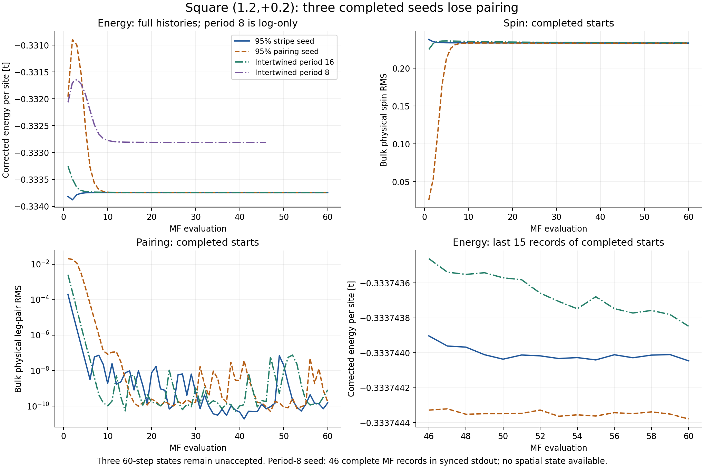
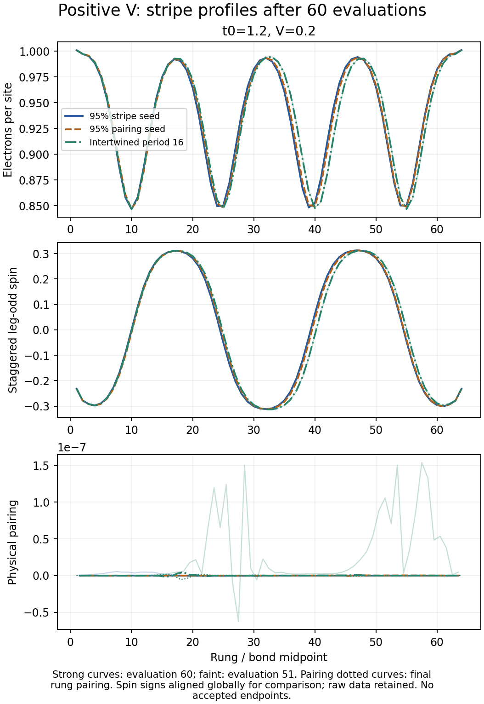

# Square (t0,V)=(1.2,+0.2): three completed seeds, one partial log

Local synchronized snapshot, 18 September 2026. Part of the
[combined campaign review](../campaign_review_20260918/README.md).

**None of the three completed starts retains appreciable pairing.** The
95% stripe seed, 95% pairing seed, and intertwined period-16 seed all reach
similar CDW/SDW stripe textures. This does not reproduce the legacy
cubic-frustrated intertwined pattern in the available square endpoints.
The period-eight intertwined seed still needs its spatial artifact before
the four-seed comparison is complete.

## Completed states

Campaign `20260915_square_t012_vp02_four_seeds_60`; L=64, chi=200, U=8,
n=0.9375 and tp=0.1, exact registry E_p. All three saved states reach 60
raw evaluations and remain `maximum_iterations`, `accepted=false`.

| Initial seed | Job | Physical spin RMS | Leg-pair RMS | Corrected endpoint energy, t/site |
|---|---:|---:|---:|---:|
| 95% stripe + 5% pairing | 58394103 | 0.233268 | 1.54e−10 | −0.333744046217 |
| 95% pairing + 5% stripe | 58394104 | 0.233212 | 1.72e−10 | −0.333744379065 |
| Intertwined charge/pair period 16 | 58394106 | 0.233581 | 8.29e−10 | −0.333743848121 |

Spin RMS uses rungs 6–59; leg-pair RMS uses bonds 6–58. Pairing stays below
1e−4 from evaluations 2, 6 and 3 respectively. Charge standard deviations
are about 0.0513. Dominant charge m=4 and spin m=30 correspond to nominal
charge period 16 and spin-envelope period 32 rungs, as in the nearby
negative/zero-V stripe states.

The period-16 seed ends with an overall spin sign opposite to the two
reference seeds. Spin is globally sign-aligned in the comparison plot only;
this symmetry reversal is not a separate phase. The exported data retain
the original signs. Small charge-wall shifts remain.

The three endpoint energies span 5.31e−7 t/site, but none is eligible for
an accepted energetic ranking. Full profile drift/slow-mode checks still
fail. The period-16 energy window also fails, and an inner-DMRG window
check fails for the stripe seed. Late discarded weights are about 2.45e−5.
The similarity of the order parameters is stronger evidence for a shared
stripe family than for complete numerical self-consistency.

## The outstanding period-eight seed

Job **58394105**, `intertwined_lambda08`, has no synced state or checkpoint.
Its stdout contains **46 complete MF evaluations** and part of the next
DMRG solve. At evaluation 46:

- density = 0.937500000;
- global absolute/relative field residual = 1.050e−4 / 1.046e−3;
- target-density-corrected energy = −0.332811522836 t/site;
- status in the record = `iterating`.

Its last-ten logged energy range is 2.78e−7 t/site. Its endpoint energy is
about 9.33e−4 t/site above the mean of the three completed endpoints, as a
transient diagnostic only. A fairly flat energy has not supplied spatial
stationarity, and stdout cannot reveal whether pairing or the imposed
shorter wavelength survives. No phase label or live scheduler status is
inferred for this missing state.

## Scientific implication

Repulsive V alone does not ensure the previously observed intertwined
CDW/SDW/pairing pattern in this square calculation. The disappearance of
pairing even from a deliberately intertwined period-16 seed is a useful
negative result for this point and protocol. It does not exclude another
wavelength, a more distant basin, different bond dimension/length, or the
still-unfinished period-eight start. Keep the legacy coexistence result
geometry-specific until the remaining comparison is available.

## Evidence and cost

- [Full audit](analysis.json), [run table](run_summary.csv), [physical profiles](terminal_profiles.csv),
  [iteration histories](iteration_history.csv), and [source hashes](sources.csv).
- [Period-eight stdout history](intertwined_lambda08_log_history.csv).
- [Seed construction and legacy reference](../square_positive_v_seeds_20260915/README.md).
- [Reproduction script](../../../scripts/analyze_two_basin_campaigns_20260918.py).

The three complete histories contain **180 evaluations** and **3.027065
solver-only fractional node-hours**. The missing job's cost is not included.
No actual allocation reconciliation for these four jobs is present locally.
The read-only audit verifies compact/config/seed hashes, compatible
fingerprints, raw updates, log counts, profiles and energy/channel formulas.
It changes neither solver acceptance nor allocation ledgers.
