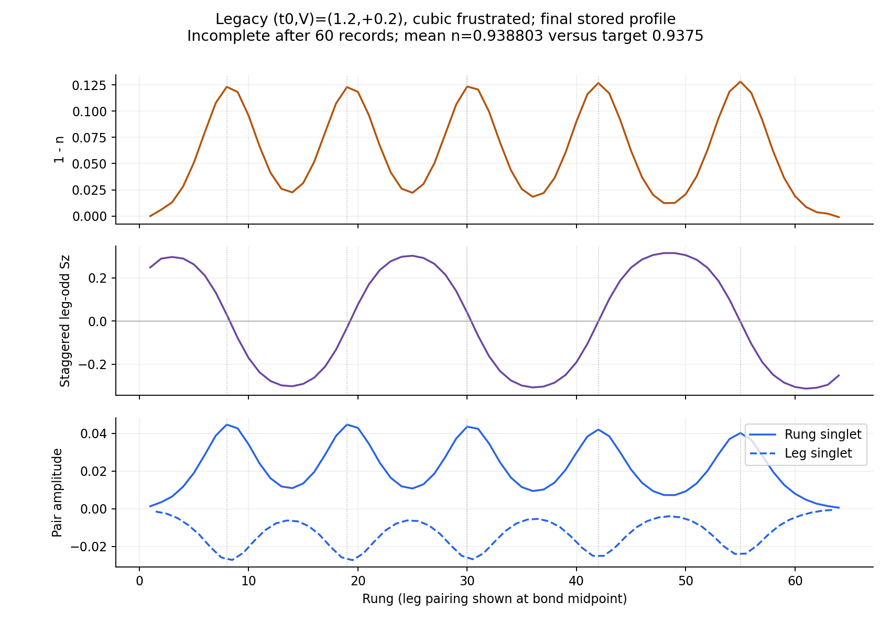
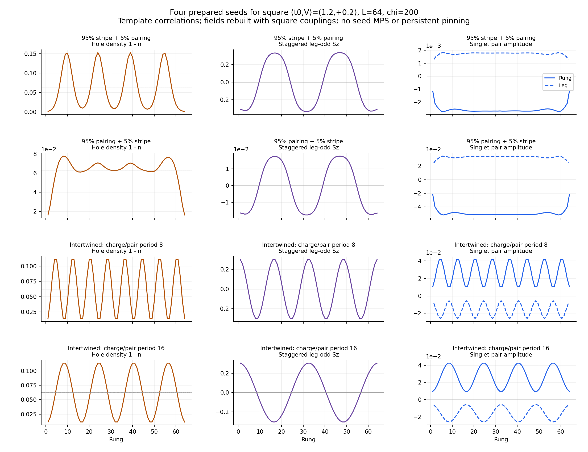

# Four seeds for square (t0,V)=(1.2,+0.2)

Final results update, September 19: [all four starts lose pairing](../square_positive_v_20260918/README.md),
including both intertwined seeds; the period-eight start retains a magnetic
defect texture. The preparation below is historical. The September 18 sync had a
partial log but no synced spatial artifact. See the
[combined campaign review](../campaign_review_20260918/README.md).
The seed construction and original submission contract below are retained.

Prepared locally September 15, 2026. The user requested a representative
positive-V comparison of the two existing stripe/pairing starts and two
additional intertwined-order starts with physically motivated wavelengths.
The working question is whether pairing, CDW and SDW can remain together on
the square array, as suggested by incomplete legacy cubic-frustrated data.
The apparent stripe/pairing competition at negative V remains a working
interpretation of the sampled grid, not an exclusion of all coexistence.

## Legacy evidence and limits



The source is the locally synced legacy file
`stateless_data/results_L_64_U_8.0_V_0.2_t0_1.2_t_p_0.1_chi_200_density_0.9375_gpu_nodamping.h5`.
It has 60 correlation records, `completed=false`, and final mean density
0.9388028989 rather than the target 0.9375. It supplies **shape guidance**,
not an accepted reference solution or an energy competitor.

This older file omits the geometry label. Comparing its stored Hartree field
with the three current kernels gives maximum discrepancies 1.10e-6 for
cubic_frustrated, 0.0837 for square and 0.1642 for cubic_unfrustrated.
Its cubic-frustrated assignment is therefore an inference from the stored
field convention, consistent with the user's description.

At the final record, hole peaks occur near rungs 8,19,30,42,55. Their uneven
11–13 rung spacing is not treated as an optimized wavelength. Over bulk
rungs 9–56, the correlation of rung-pair magnitude with holes is +0.9923;
with absolute staggered leg-odd Sz it is -0.9657. Rung singlet pairing is
positive throughout and nearest-neighbor leg singlet pairing is negative.
Thus the observed form has a common superconducting phase between peaks
with a d-wave-like rung/leg sign difference. A pairing sign reversal from
one stripe to the next is not observed in this source.

The physical observables use Sz=(n_up-n_down)/2. The plotted spin envelope
is (-1)^(i-1) times the leg-odd average (Sz_leg1-Sz_leg2)/2. Pair plots use
the symmetric anomalous correlation matrix, with leg pairs at bond midpoints.
The [source summary](legacy_summary.json) and [profiles](legacy_profiles.csv)
record the measurements. No source file was modified.

## Four independent starts



| Family | Construction | Charge/pairing period | Spin-envelope period |
|---|---|---:|---:|
| stripe_weak_other | Existing 95% stripe + 5% uniform d-wave reference correlations | Inherited profile | Inherited profile |
| pairing_weak_other | Existing 95% uniform d-wave + 5% stripe reference correlations | Inherited profile | Inherited profile |
| intertwined_lambda08 | Smooth legacy-inspired intertwined texture | 8 rungs | 16 rungs |
| intertwined_lambda16 | Smooth legacy-inspired intertwined texture | 16 rungs | 32 rungs |

All four receive a fresh MPS with the same initialization RNG seed (1404).
They inherit only their initial fields, rebuilt from the template correlations
with the **target square kernel** and the target pair-binding denominator.
No legacy MPS, spatial pinning term or constraint on surviving order is used.
The two reference mixtures are unchanged from the earlier campaigns apart
from their target Hamiltonian. The new pair uses the same amplitudes and
relative bond structure, varying only the nominal wavelength.

At n=15/16, the two-leg ladder has 2(1-n)=1/8 holes per rung. A period-eight
cell contains one hole, while a period-sixteen cell contains two. These are
the half-filled and filled stripe-counting alternatives (one-half or one hole
per transverse site in a two-site-wide stripe). Both fit an integer number
of charge and spin-envelope cycles into L=64. This motivates the comparison;
it does not assert a quantized charge at each local maximum or predict which
wavelength is optimal. The legacy's irregular 11–13 rung spacing lies between
them; other wavelengths remain possible.

For each new texture, write x=i-1/2 and lambda=8 or 16:

```text
n(i,leg)  = 0.9375 + A cos(2 pi x/lambda)
Sz(i,leg) = S (-1)^(i-1+leg) cos(pi x/lambda), leg=0,1
P_rung(x) = P0 - P1 cos(2 pi x/lambda)
```

This places holes and pairing at spin antiphase walls. The charge is leg-even
and spin leg-odd, so the total spin is zero. Both seeds have exactly the
target mean density. P0>P1>0 keeps the pairing phase uniform between peaks.

The amplitudes come from robust bulk quantiles of the legacy data:
A=0.0520678392, S=0.3061558088, P0=0.0260201643 and
P1=0.0167601652. A is half the 5th–95th percentile density span; S is the
95th percentile of absolute spin envelope; P0 and P1 are the midpoint and
half-span of the rung-pair 5th/95th percentiles. The finite-grid samples
need not attain the continuous sine-wave extrema.

For relative rung offsets 0–4 and same/opposite legs, the legacy symmetric
pair matrix is fitted to the local rung-pair envelope through the origin.
These relative-bond coefficients multiply P(x) at the target bond midpoint.
The nearest leg coefficient is -0.604435 times the rung envelope, retaining
the observed relative sign. Normal off-diagonal correlations are averaged
over bulk translations, both spins and equivalent legs. On-site diagonals
are replaced by the declared n/2 +/- Sz. These synthetic correlations are
field templates, not a claim that an MPS with all these correlators exists.
No irregular peak positions, spin-domain lengths or edge envelope are copied.

Square geometry has zero cross-leg interladder alpha/beta entries; those
zeros are explicitly checked. A nonzero rung-pair template is therefore not
mistaken for a directly imposed rung-pair field in the square model. The
nearest-leg and other retained same-leg correlations supply pairing access.

The versioned `data/positive_v_intertwined_recipe.toml` contains the compact
source-derived amplitudes, bond coefficients and provenance. It allows
preparation after fetching without transferring the full legacy file.
The [four-branch receipt](prepared_branches.csv) and
[seed profiles](seed_profiles.csv) describe the local preview. Units and
vertical scales are shown separately so the weak reference components remain
visible; the opposite overall pair sign of the new and old families is a
global gauge choice, not a different relative form factor.

## Run controls and interpretation

- Square L=64, U=8, t0=1.2, V=+0.2, t_perp=0.1, n=0.9375, chi=200.
- Exact highest-chi registry row: signed E_p=-0.15307266912955697 at bare
  chi=1000. The positive denominator is its magnitude; no interpolation or
  new pair-binding job is needed.
- Raw MF updates throughout, no Anderson, 60 maximum and 40 minimum map
  evaluations, ten stable records, save every iteration.
- Field absolute/relative tolerances 1e-7/1e-4, channel noise floor 5e-7,
  full-window drift and slow-mode checks retained. Energy window 1e-7 t/site;
  inner-DMRG stop/acceptance tolerance 1e-7 t total. These match the recent
  square finer-cut controls. Energy and full spatial histories remain stored.
- Per branch: one GPU, 12-hour Slurm ceiling, 11.5-hour solver deadline,
  one segment with no automatic extension. Four branches reserve at most
  **12 node-hours**, or at most 240 MF evaluations. Actual cost may be lower.

The same channels are free in all four starts. Pairing may decay to a stripe,
spin/charge modulation may decay toward a paired state, or both may survive.
Calling the latter a coexistence candidate requires stationary bulk orders
and the usual self-consistency/energy gates, not merely nonzero endpoint
pairing. A long transient or slowly moving domain wall remains unresolved.

The new seeds remove arbitrary *inherited* peak locations but cannot remove
open-boundary or algorithmic pinning. If different starts converge to the
same texture up to a translation/global pairing sign, compare their bulk
profiles, wavelengths and matching corrected canonical energies. If distinct
textures persist, distinguish accepted metastable states from unfinished
relaxation. Do not loosen convergence to hide sliding or average different
textures into a fixed point. A translated-seed check can be considered later
if pinning remains the limiting question; it is not included in these four
jobs. Rank accepted solutions only after all comparison fingerprints match.

## Perlmutter handoff

The user runs the following commands. A new worktree preserves the source of
the submitted cubic campaign and any finer-cut jobs submitted in the meantime:

```bash
cd "$CFS/m4863/MPS-MFT/ladder_mps_mft"
git -C .. fetch origin
git -C .. worktree add --detach "$CFS/m4863/MPS-MFT-square-positive-v" origin/codex/mps-mft-phase0-refactor
cd "$CFS/m4863/MPS-MFT-square-positive-v/ladder_mps_mft"
bash slurm/submit_square_positive_v.sh
```

The launcher inherits the existing account, shared run/scratch roots and
append-only budget/reconciliation ledgers from the original anchor run.env.
It reconciles and submits through the existing budget gates, and refuses to
use the original checkout. All four seeds are prepared before submission.
No old environments or campaign artifacts are changed.

From the new checkout, progress is:

```bash
bash slurm/phase1_gpu.sh status 20260915_square_t012_vp02_four_seeds_60
```

No jobs were submitted or queried locally. Cubic submission remains
user-reported; submission status for the finer cuts and short square V=0
extension has not been reported in this task.

## Validation and reproduction

Local preparation and focused Julia tests passed **82 assertions**: exact
E_p, density/spin sums, correlation symmetry, wavelengths and antiphase
relations, hole count, pairing/charge alignment, square kernel and its
cross-leg zeros, unchanged reference mixtures, fresh-MPS configuration,
matching fingerprints and immutable-preparation guards. The test runs in
a temporary directory; the separate preview remains available under
`output/seed_previews/20260915_square_positive_v/control/`.

Six local launcher syntax/mock/guard tests passed, including the new wrapper's
accounting and source-isolation checks and existing launcher regressions.
No solver source changed, and no DMRG or full suite was run. Source hashes
were checked before and after extraction; both PNGs were visually checked.

Reproduce from the ladder subproject, with the original legacy file available
for the first command:

```text
python scripts/inspect_positive_v_legacy.py
julia --project=. test/test_square_positive_v.jl
python scripts/plot_square_positive_v_seeds.py
```

The last command uses the existing local preview. To create a fresh preview,
call `scripts/prepare_phase1_square_positive_v.jl` with six arguments:
the base config, `data/two_basin_references.h5`, the recipe TOML, a new
control directory, a new full-output directory and a run ID. Preparation
requires no legacy HDF5 or GPU initialization.

Provenance:

- Legacy source SHA-256:
  `8a8f5b917d11259d34ce773cb2860fb20d809f5dccfd252342f69a4596b9fec6`.
- Recipe SHA-256:
  `786fa2e8846820f42aabbabb625c3a645558d25e5388afa4058abf63cf834d35`.
- Base-config SHA-256:
  `f5f859581210324dc388e41250fb28961f5b0f12fa811365cbaf88c4142b0e5a`.
- Model fingerprint for all four branches:
  `a994c1ee7bf7b9cbe952f448e20f451520143edecb2432f26c5bcc07e744d50c`.
- Numerical fingerprint:
  `d928882239844f67c88e7020a4f1f3bf9ae009060c3dc5256406fcf6b18a8e2e`.
- Unchanged solver implementation fingerprint:
  `c054eb9690ce308e1dfb413bbc82d5e430eeecd3bf7f0b018acce267be9ccc99`.
