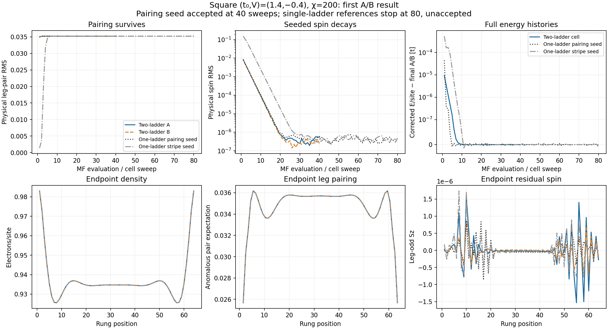

# First square A/B result — September 21, 2026

**The completed pairing-seeded A/B run at (t0,V)=(1.4,-0.4) reproduces the
single-ladder paired state.** Allowing two independent ladder profiles does
not produce the stripe conversion observed in the trellis comparison.
Job 58654275 is a saved, accepted fixed point after 40 cell sweeps (80
individual ladder evaluations), with complete terminal measurements on A/B.
The 40-sweep minimum was reached before the 60-sweep cap.

The figure compares physical order and full density-corrected canonical
energy histories with both original one-ladder seeds. The lower profiles
overlap except for residual spin on the 1e-6 scale. Endpoint density and
pairing retain the same open-end modulation as the one-ladder calculation.
The old references have 80 evaluations and remain formally unaccepted under
their archived tighter controls; this difference in flags is not evidence
that the larger cell intrinsically converges faster.

| Quantity | One ladder, pairing seed | One ladder, stripe seed | New A | New B |
|---|---:|---:|---:|---:|
| Physical leg-pair RMS | 0.035224674 | 0.035224919 | 0.035225077 | 0.035225172 |
| Physical spin RMS | 3.112e-7 | 4.841e-7 | 5.369e-7 | 2.519e-7 |
| Mean rung pair | -0.053241318 | -0.053241694 | -0.053241972 | -0.053242106 |
| Bulk charge standard deviation | 0.00316554 | 0.00316596 | 0.00316439 | 0.00316500 |

Spin is the leg-odd physical Sz component on rungs 6–59. Pair RMS uses
the symmetrized nearest-neighbor anomalous expectation averaged over the
legs, on bonds 6–58. Rung means and charge deviations use rungs 6–59.
Positive leg and negative rung pairing retain the d-wave-like sign pattern.
These anomalous expectations are distinct from pair–pair correlations.

## Transverse asymmetry and convergence

The weak shifted stripe perturbation decays: A/B spin RMS falls from
0.00845/0.00804 at the first evaluation to the values above, reaching
the small fluctuating tail by about sweep 20. The full-length RMS of
A-minus-B spin falls from 0.01176 to 3.187e-7. Final maximum A/B differences
are 7.31e-6 in density and 1.08e-6 in leg pairing; these are consistent with
the small solver/density-targeting differences in otherwise coincident
profiles, rather than a resolved transverse stripe texture.

Both ladders independently pass the recomputed terminal ten-record field,
slow-mode, density, inner-DMRG, channel-window, energy and consistency gates.
Final global relative field residuals are 8.56e-6 (A) and 1.84e-5 (B).
Density errors are 1.41e-6 and 5.30e-6. Each ladder's corrected energy
window is below 2.66e-9 t/site; the simultaneous cell window is 3.22e-10.
The field checks retain the 5e-7 absolute channel noise floor. Tiny remaining
spin fluctuations are not a demonstrated growing instability.

## Energy comparison

The new simultaneous-cell corrected energy is **-1.167404800545 t/site**.
It differs from the old pairing endpoint by +7.73e-9 and the old stripe
endpoint by +2.42e-10 t/site. There is no resolved energy gain associated
with a new phase. The comparison uses division by 256 for the A/B cell and
128 for a single ladder, with identical physical couplings, density target,
range and exact pair-binding denominator. The square A=B embedding is exact.

Uncorrected canonical energies differ by +1.12e-6/+2.48e-6 t/site because
the numerical particle densities differ slightly. The new canonical energy
is -1.167406636373 t/site. Density correction explains this apparent larger
offset; the corrected differences are not useful as a ranking of distinct
phases. The old states' unaccepted flags remain unchanged.

The independently synced stripe-seed stdout (job 58654274) also reports
`fixed_point` at sweep 40 with corrected energy -1.167404800596 t/site,
only 5.1e-11 below the completed pairing seed, and begins terminal
measurements. Its terminal state/diagnostics are absent in this sync, so
this supports energetic agreement but is not yet a profile comparison or
confirmation of completed measurements. No V=-0.2 result is present.

## Measurements and evidence boundary

Both completed diagnostic sidecars are linked by SHA-256 to the same full
state and mark all measurements complete. They include the 318-operator
rung/leg/onsite singlet-pair basis, raw and connected pair correlations,
charge/spin, density-spin, Green functions, anomalous expectations, double
occupancy and entanglement. Density agrees with the terminal state; connected
subtractions were checked. The old comparison sources do not supply the same
full diagnostic sidecars here, so no new-versus-old pair–pair comparison is
claimed. These measurements are intraladder, not interladder entanglement.

Recorded solver time is 16,531.96 s (4.59 h); the two measurement passes
take 5,950.30 and 5,964.31 s (3.31 h combined). Their sum corresponds to
1.9755 shared-GPU node-hours excluding startup, I/O and other overhead.
No completed-job allocation record is synced, so this is not exact billing.

This is evidence that the paired state survives this explicit two-ladder
perturbation at (1.4,-0.4), within chi=200 and the tested seeds. It does not
establish stability against every transverse period, texture or larger-chi
perturbation, nor decide the remaining (1.4,-0.2) point.

Reproduce locally with `python scripts/analyze_square_two_ladder_20260921.py`.
The [numerical receipt](first_result_20260921.json) records source hashes,
gates, profile differences, energies and the separate log-only evidence.
The script reuses the archived single-ladder reader and checks model/config/
seed/state lineage, raw updates, physical density, energy normalization and
double counting. No simulation, immutable artifact or acceptance flag was
modified. Figure rendering was visually checked. Ready within reviewed scope.
