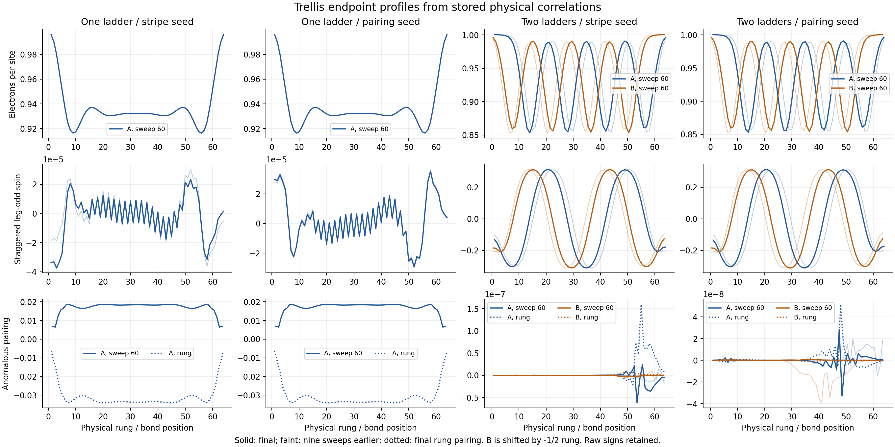
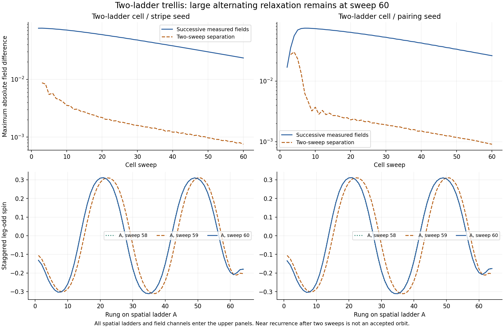

# Trellis: paired one-ladder cell, striped two-ladder trajectories

**Updated 19 September 2026 from all four user-synchronized final states.**
The earlier one-completed-run assessment is superseded. Both seeds approach
the same paired texture in the skew one-ladder cell. Both lose pairing and
retain strong stripes in the rectangular two-ladder cell, where large
alternating relaxation still prevents convergence.

All runs use (t0,V)=(1,0), U=8, tau0=tau1=0.1, density 15/16, L=64 per
ladder, chi=200 and 60 raw cell sweeps. All four retain
`status=maximum_iterations`, `accepted=false`. A/B denote two spatial
ladders solved from the previous cell fields, not successive MF iterations.

| Cell / seed | Job | Final spin RMS, A / B | Final leg-pair RMS, A / B | Corrected energy, t/site | Final-ten energy range |
|---|---:|---:|---:|---:|---:|
| One / stripe | 58468871 | 1.215e−5 | 0.01796892 | −0.518820336467 | 2.84e−7 |
| One / pairing | 58468873 | 1.368e−5 | 0.01796878 | −0.518820322856 | 2.83e−7 |
| Two / stripe | 58468875 | 0.228442 / 0.228761 | 1.26e−8 / 1.18e−9 | −0.521125816792 | 1.53e−4 |
| Two / pairing | 58468876 | 0.228234 / 0.228755 | 6.56e−9 / 2.60e−10 | −0.521055560230 | 1.92e−4 |

Energy is the target-density-corrected canonical functional divided by
128 sites for one ladder or 256 for two. Spin RMS uses rungs 6–59;
the two-leg-averaged anomalous leg-pair RMS uses bonds with left rungs 6–58.
These are observed endpoints, not accepted branch energies.


## The one-ladder seeds agree on a paired texture

In **Figure 1**, the stripe start loses spin (0.0627 to 1.21e−5) and gains
pairing (0.00965 to 0.01797). The pairing start retains pairing and loses its
weak stripe component. Final leg/rung means are about **+0.01796/−0.03292**
in both runs: d-wave-like internal signs, not a spatial pair-density wave.

The endpoint energies differ by only **1.361e−8 t/site**, much less than
their summed recent energy ranges of 5.678e−7. Maximum seed-to-seed differences
are 6.27e−6 in charge and 5.68e−7 in leg pairing across the full ladder.
This supports the same qualitative paired basin. It does not certify
a fixed point: energy windows, inner-DMRG and some channel/profile gates fail.
Final inner-sweep energy changes are about 3e−7 t total versus 1e−7 allowed.
Small residual spin fluctuates near 1e−5 rather than decaying monotonically
to zero; assigning it robust magnetic order would be premature.



**Figure 2** distinguishes end-dependent one-ladder charge structure
(central charge standard deviation about 0.00157) from persistent central
CDW in the two-ladder runs (about 0.0467–0.0470). One-ladder charge oscillations
alone do not establish bulk intertwining. Tiny pairing panels in the two-ladder
columns use 1e−7/1e−8 scales and are negligible compared with the one-ladder
paired amplitude. Raw signs are retained; B has physical offset −1/2 rung.

## Two-ladder stripes still undergo large alternating relaxation

The pairing start rapidly develops spin and loses pairing. Both final A/B
textures have charge Fourier mode m=4 and spin mode m=30, consistent with
nominal charge/spin-envelope periods 16/32. Neighboring ladders have shifted
charge minima and spin nodes; they are not identical profiles copied at
the same rung index.

A nearly constant spin RMS hides a large moving texture. Final global relative
residuals are **0.1845–0.2085**, versus 1e−4 allowed. Final inner-DMRG windows
pass in both runs, so the principal problem is the outer MF iteration.
Energy windows and most normal-field/channel windows also fail.



In **Figure 3**, successive measured full-cell field increments have cosine
**−0.999962** (stripe seed) and **−0.999943** (pairing seed). Their norm ratios
are about **0.975**, consistent with a slowly damped alternating mode, not
established endpoint growth. Maximum field changes are 0.02345/0.02620 over
one sweep but 0.000754/0.000910 over two, only 3.22/3.47% as large. Even
two-sweep differences remain resolved. Pointwise spin changes between
sweeps 59 and 60 reach roughly 0.14–0.16.

This is an alternating transient with continuing drift, **not an accepted
period-two orbit**; MF sweep number is not physical time. A/B are spatial
states, separate from the temporal numerical oscillation. A future controlled
test of modest linear damping could target this negative iteration mode
without Anderson. No mixing change or continuation is prepared here; such
a test would still need spatial/stability checks.

## What the cell comparison establishes

The earlier statement that “trellis develops pairing whereas square/cubic
develop stripes” applies to the **skew one-ladder ansatz**. The rectangular
A/B test also accesses stripes from both seeds. Independent spatial profiles
permit relative texture arrangements absent from a single repeated profile;
different open-end cuts are an additional finite-size distinction. The
ansatz and relative stripe arrangement matter alongside lattice connectivity.

The two-ladder endpoints lie 0.00224–0.00231 t/site below the one-ladder
endpoints, as **diagnostic functional values**. Within the two-ladder cell,
the pairing-seeded endpoint is 7.026e−5 t/site above the stripe-seeded endpoint,
less than their summed final-ten ranges of 3.445e−4. Large self-consistency
residuals, different cell fingerprints and finite-OBC embeddings prevent a
certified cell/phase ranking. These are not converged stripe ground states.

The paired one-ladder branch remains a useful reference for future pair–pair
measurements. Vanishing anomalous order in the two-ladder trajectories does
not by itself determine connected local pair correlations. No new
four-fermion measurement enters this report.

## Evidence, cost and reproduction

There are **240 cell sweeps and 360 individual ladder solves** across four
jobs/six spatial histories. Recorded solver time is **8.627653 fractional
node-hours**; synced completed-job accounting gives **8.708542 actual node-hours**.

- [Summaries and within-cell comparisons](analysis.json),
  [source inventory](sources.csv), [identified histories](iteration_history.csv),
  [physical profiles](terminal_profiles.csv), [alternation diagnostics](relaxation_diagnostics.json).
- `partial_log_histories.csv` remains a historical September 18 snapshot;
  `analysis.json` now has no missing branches.
- [Trellis method contract](../../TRELLIS_MEAN_FIELD.md),
  [preparation](../trellis_comparison_20260916/README.md),
  [combined report](../campaign_review_20260918/README.md).

Run locally from the repository root:

```powershell
C:/Python313/python.exe -B -X utf8 ladder_mps_mft/scripts/analyze_trellis_progress_20260918.py
C:/Python313/python.exe -B -X utf8 ladder_mps_mft/scripts/complete_campaign_analysis_20260919.py
```

Trellis Hartree fields contain normal-bond terms. Profiles here come directly
from saved correlations, never square/cubic Hartree inversion. Checks cover
hashes, seeds/configs, fingerprints within each cell, update adjacency,
endpoint correlations, canonical reconstruction, density correction, site
normalization, channel windows, logs and accounting. States and acceptance
flags are unchanged.
