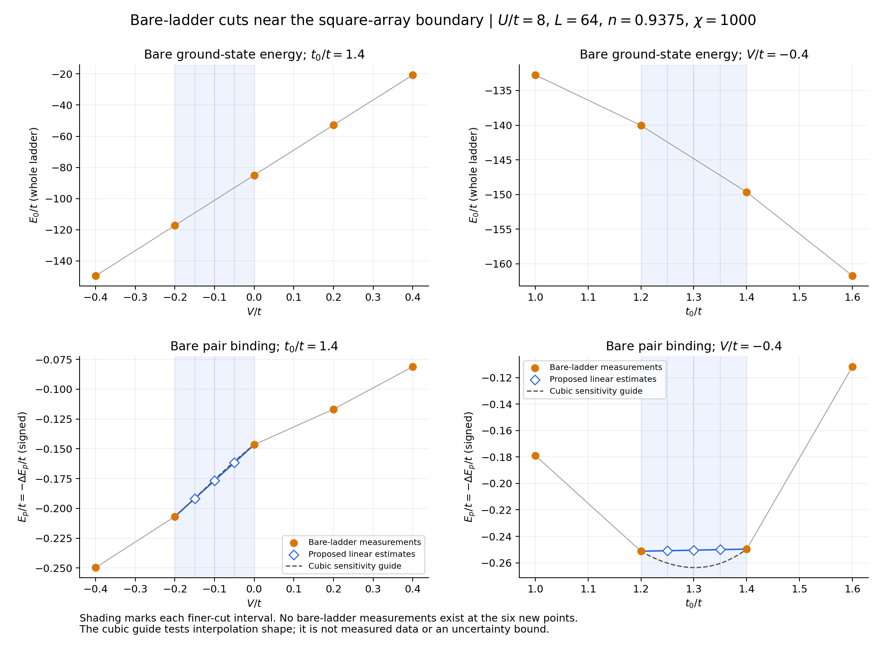

# Square finer cuts and bare-ladder interpolation check

Results update, September 18: all twelve starts have completed their caps.
The [finer-cut analysis](../square_fine_cuts_20260918/README.md) identifies
two coordinates with distinct stripe/paired trajectories and preserves
the interpolation qualification below. It is included in the
[combined campaign review](../campaign_review_20260918/README.md).

Prepared locally September 15, 2026. The user requested six new square-array
coordinates, with two reciprocal 95%/5% stripe/pairing starts at each, and
linear interpolation of the pair-binding energy between the existing coarse
endpoints. The user also requested the bare-ladder energy and pair-binding
plots below before interpreting these finer cuts.

## Bare-ladder evidence



The source is `data/E_p_values.csv`, at L=64, U/t=8, n=0.9375. Select highest
chi and then smallest recorded `rel_diff` at each coordinate: all selected
measurements have **bare-ladder chi=1000**, distinct from the new MF runs'
chi=200. There are five measured V points at t0=1.4 and four measured t0 points
at V=-0.4 (eight unique rows because the cuts intersect). All eight relevant
rows agree with the root legacy registry. No bare-ladder measurements exist
at the six proposed new coordinates. The root plots are preserved.

The total bare ground-state energy looks smooth at the measured resolution.
For increasing V, the consecutive energy secant slopes are 161.808, 161.457,
161.099 and 160.707. For increasing t0 they are -36.417, -48.102 and -60.471.
The latter curve has substantial smooth curvature; neither sparse scan
resolves a sharp feature at the prospective array transition.

The pair-binding magnitude grows toward t0=1.2–1.4 at V=-0.4 and falls by
t0=1.6. Thus the t0 refinement spans a broad binding maximum in the sampled
data. A straight line between 1.2 and 1.4 treats the binding magnitude as
nearly constant, but cannot establish that it is flat inside this interval.

The dashed **degree-three polynomial** interpolates the four neighboring
measured points and is only a shape-sensitivity diagnostic. Relative to the
requested straight line, its implied t_perp^2/|E_p| changes by:

| Cut | New coordinate | Coupling change with polynomial guide |
|---|---:|---:|
| t0=1.4 | V=-0.15 | +0.124% |
| t0=1.4 | V=-0.10 | +0.464% |
| t0=1.4 | V=-0.05 | +0.615% |
| V=-0.4 | t0=1.25 | -3.602% |
| V=-0.4 | t0=1.30 | -4.987% |
| V=-0.4 | t0=1.35 | -3.973% |

This supports linear interpolation as a preliminary approximation, with
greater sensitivity on the t0 cut. These percentages are **not error bars**,
new measurements, or a bound on the true interpolation error. The polynomial
is not used in the runs. Direct bare-ladder measurements near t0=1.3 would
be useful before making a precise boundary claim, but are not part of this
campaign. Smooth sampled bare energies cannot settle the order of the
coupled-array transition or rule out an unresolved bare-ladder feature.

Separate figures, each with a same-named PDF companion:

- [Ground-state energy at t0=1.4](ladder_E0s_U_8_t0_1p4.png)
- [Pair binding at t0=1.4](ladder_Eps_U_8_t0_1p4.png)
- [Ground-state energy at V=-0.4](ladder_E0s_U_8_V_m0p4.png)
- [Pair binding at V=-0.4](ladder_Eps_U_8_V_m0p4.png)

Reproduce with `python scripts/plot_bare_ladder_fine_cuts.py` from the ladder
subproject. [Measured rows](bare_ladder_measurements.csv),
[interpolation calculations](interpolated_ep.csv), and the
[source hash](bare_ladder_source_sha256.txt) make the figures inspectable.
Registry SHA-256:
`2209bd2ca3c1ad02c0e542d1a9d63ecf90fdfa49120ad9cc3af599a5b4bc1f0e`.

## Prepared numerical contract

Each coordinate starts independently from the versioned reference correlations
in `data/two_basin_references.h5`: stripe at (1.0,0.0), uniform d-wave at
(1.4,-0.4). The two families are 95% stripe + 5% pairing and the reciprocal
mixture. Rebuild fields from these correlations using the target model's
couplings, with fresh MPS initialization. These are basin comparisons, not
parameter continuations or a hysteresis scan. All order channels remain free.

Controls follow the just-prepared cubic comparison, using the square density
kernel and square absolute field tolerances:

| Setting | Value |
|---|---|
| Geometry, length, density | square, L=64, n=0.9375 |
| U/t, t_perp/t, chi | 8, 0.1, 200 |
| MF updates | raw, mixing=1, no Anderson |
| MF evaluation cap / minimum | 60 / 40 |
| Required stable window | 10 records |
| Absolute / relative field tolerance | 1e-7 / 1e-4 |
| Channel noise floor | 5e-7 |
| Energy window | 1e-7 t/site |
| Inner DMRG energy stop and acceptance tolerance | 1e-7 t total |
| Solver / Slurm limit per branch | 11.5 / 12 hours |
| Automatic segments | one; no automatic extension |

Full-window channel drift, slow-mode, density, energy-identity and eigenvalue
consistency checks remain enabled. The minimum of 40 protects against the
late pairing collapse observed around evaluations 25–35 at (1.2,-0.4).
Qualifying these controls from saved square histories is documented in the
[preceding campaign report](../two_basin_next_campaigns_20260915/README.md).

Interpolate the signed value, E_p(x)=(1-w)E_p(a)+w E_p(b),
w=(x-a)/(b-a), then use its positive magnitude in the denominator. For the V
cut the fixed endpoints are V=-0.2 and 0 at t0=1.4; for the t0 cut they are
t0=1.2 and 1.4 at V=-0.4. No extrapolation or interpolation through a sign
change is allowed. The preparer pins the registry hash and verifies both
endpoints. Existing exact-row and default t0-interpolation behavior is retained;
V interpolation requires the explicit `pair_binding.interpolation_axis="V"`.

| t0/t | V/t | Interpolated signed E_p/t | t_perp^2/\|E_p\|, in t |
|---:|---:|---:|---:|
| 1.4 | -0.05 | -0.161603363933 | 0.061879900001 |
| 1.4 | -0.10 | -0.176668996947 | 0.056603026976 |
| 1.4 | -0.15 | -0.191734629960 | 0.052155419196 |
| 1.25 | -0.4 | -0.250840503161 | 0.039865970104 |
| 1.30 | -0.4 | -0.250435121710 | 0.039930501488 |
| 1.35 | -0.4 | -0.250029740259 | 0.039995242124 |

Interpolation mode, endpoints, weight and source hash are retained in the
manifest, seed provenance, model provenance and output checkpoints. Both seed
families have matching model/numerical/implementation fingerprints at each
coordinate; see [all twelve prepared branches](prepared_points.csv).
An accepted branch establishes a self-consistent candidate. If its competitor
is still evolving, a provisional basin assignment may be useful, but the
energy comparison remains unresolved. Preserve mixed orders, acceptance flags
and full energy histories; do not infer seed ancestry as final phase or rank
unaccepted endpoints as converged solutions.

## Submission on Perlmutter

The user reports the cubic runs have been submitted. No job IDs or scheduler
evidence for that new campaign have been synced locally yet. Square V=0
continuation submission has not been reported. Because V interpolation changes
the solver source, preserve the original checkout for those prepared/submitted
jobs and create a separate worktree for the new cuts:

```bash
cd "$CFS/m4863/MPS-MFT/ladder_mps_mft"
git -C .. fetch origin
git -C .. worktree add --detach "$CFS/m4863/MPS-MFT-square-fine-cuts" origin/codex/mps-mft-phase0-refactor
cd "$CFS/m4863/MPS-MFT-square-fine-cuts/ladder_mps_mft"
bash slurm/submit_square_two_basin_fine_cuts.sh
```

Run these commands yourself on Perlmutter. The launcher prepares and submits
all **12 branches** through the existing shared budget gates. It inherits
account, output/scratch roots and budget/reconciliation ledgers from the
original anchor run's `run.env`; the old environment file is unchanged.
The wrapper refuses to run in the original checkout. Both the reference
bundle and GPU Manifest are versioned, so no new input transfer is needed.

Reservation ceiling: 12 branches x 12 hours x 0.25 GPU-node share =
**36 node-hours**, and at most 720 MF evaluations. Actual cost can be lower.
No pair-binding jobs or automatic follow-up segments are included. Available
budget is reconciled and checked during the user-run submission.

From the new worktree, check progress with:

```bash
bash slurm/phase1_gpu.sh status 20260915_square_two_basin_fine_cuts_95_5_60
```

## Local validation

- Real preparation of all twelve configs and field seeds passed. The focused
  Julia check passed 16 fixed-reference-length, 45 interpolation/regression
  and 171 prepared-branch assertions (232 total). Checks include signed
  arithmetic, bounds, seed fields rebuilt at target coupling, provenance,
  campaign controls, and preservation of a known legacy model fingerprint.
- Existing raw-basin checks passed 52+23 assertions. Launcher mock/guard tests
  passed all five cases, including separate-checkout enforcement, inherited
  budget/account, fresh run metadata and existing wrapper regressions.
- Main launcher and new wrapper passed Bash syntax checks. Plot values were
  compared independently against the Julia-prepared branch receipt; source
  registries were not modified. Overview and representative individual PNGs
  were visually checked. A clipped standalone title was corrected.
- These are local unit, preparation, plotting and mocked-launcher checks.
  No DMRG simulation, full test suite, Perlmutter connection, scheduler action
  or new allocation measurement was performed. Local Git metadata collection
  emitted sandbox ownership warnings; numerical/model checks still passed.

Base-config SHA-256:
`92aed5482edf8723bd363a61b3e573d951f0532e24e43315f3269771ea55ca63`.
Prepared numerical fingerprint:
`d928882239844f67c88e7020a4f1f3bf9ae009060c3dc5256406fcf6b18a8e2e`.
Implementation fingerprint:
`c054eb9690ce308e1dfb413bbc82d5e430eeecd3bf7f0b018acce267be9ccc99`.
