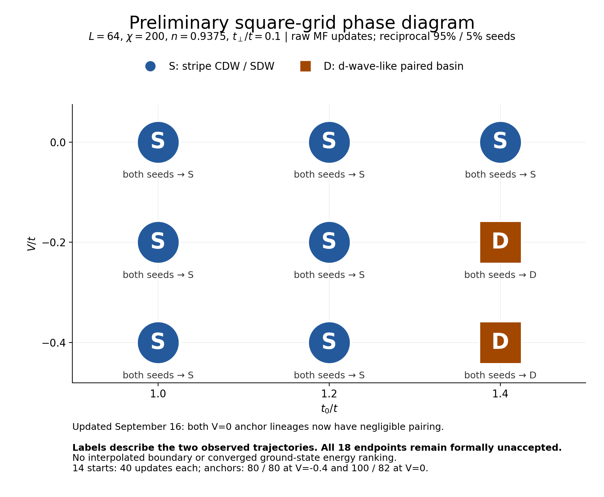
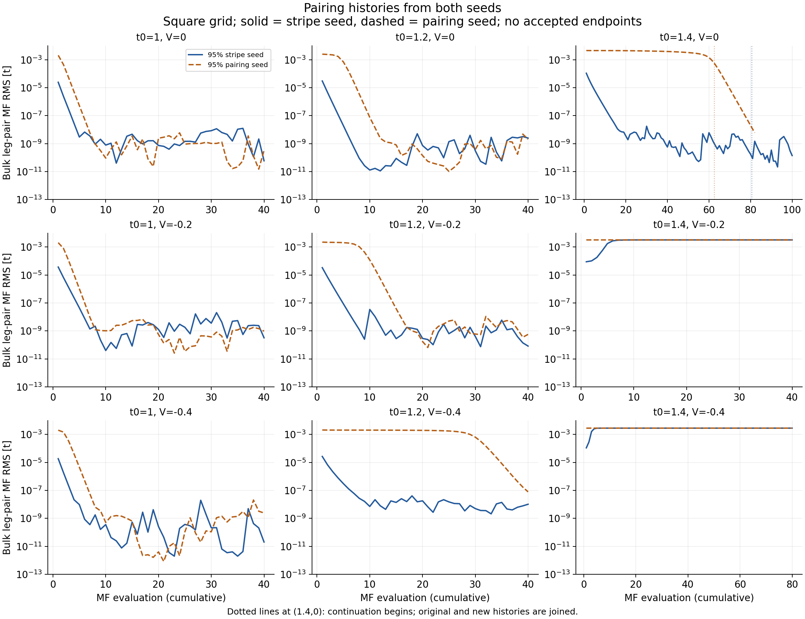
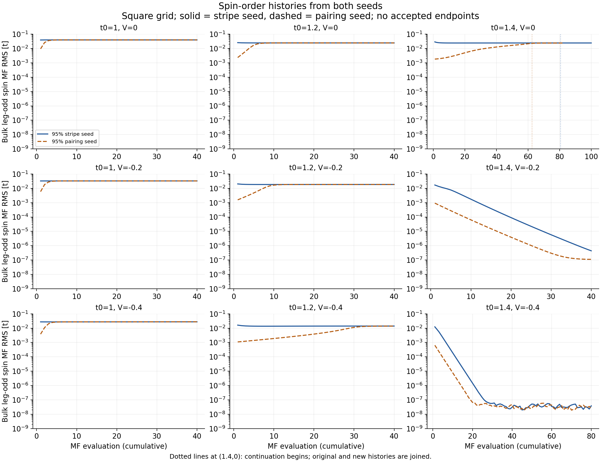
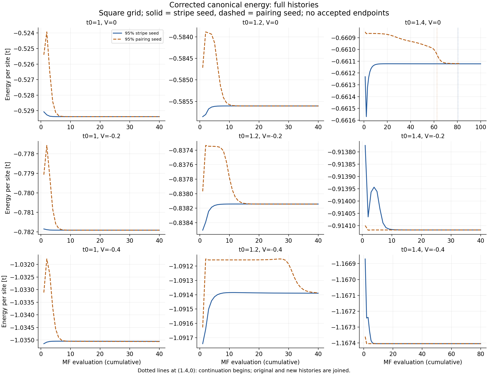
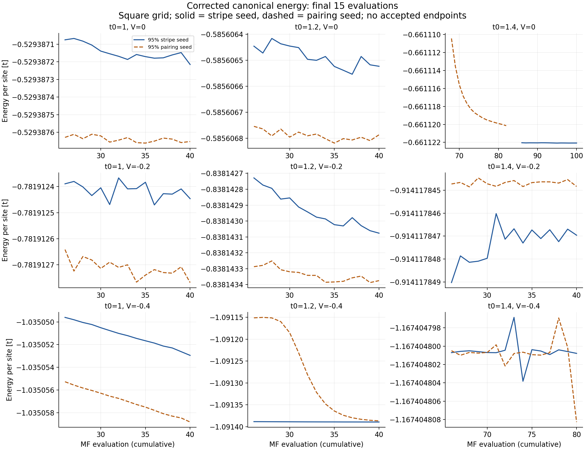

# Preliminary square two-basin phase diagram — September 15, 2026

Updated September 16 to include both square `(1.4,0)` continuations.

**The nine-point grid supports seven stripe assignments and two d-wave-like
paired assignments.** Both seed lineages now reach the same phase family at
all nine points. At `(t0,V)=(1.4,0)`, the pairing lineage loses its residual
pairing during the continuation; its former `S*` assignment is now `S`.
The report includes 20 source artifacts representing 18 independent seed
lineages and 902 MF evaluations. None of the latest endpoints passes its
archived formal acceptance checks. These are preliminary
basin assignments from spatial order and full raw histories, not a converged
ground-state energy selection.



[Phase-diagram PDF](preliminary_phase_diagram.pdf) ·
[All 18 endpoint diagnostics](run_summary.csv) · [Analysis and provenance](analysis.json)

## Coverage and phase evidence

Square geometry, `L=64` rungs / 128 sites, `chi=200`, density `0.9375`,
`tp/t=0.1`. Every point has reciprocal 95%/5% mixtures of the stripe and
paired references, reconstructed at its target couplings. The four original
anchors use their archived 80-step controls; the fourteen new runs use the
revised 40-step controls. Both V=0 anchors then receive 20 additional raw
evaluations under the September 15 continuation controls, reaching 100/82
cumulative evaluations. Full histories retain the parent records, with
dotted lines marking continuation starts. All three campaigns use no Anderson.

| V / t | t0 / t = 1.0 | t0 / t = 1.2 | t0 / t = 1.4 |
|---|---|---|---|
| 0.0 | Stripe, both seeds | Stripe, both seeds | Stripe, both seeds after continuation |
| -0.2 | Stripe, both seeds | Stripe, both seeds | Paired, both seeds |
| -0.4 | Stripe, both seeds | Stripe, both seeds; recent conversion | Paired, both seeds |

The observed separation is large. At the six points with `t0<=1.2`, final
bulk physical leg-odd spin RMS is `0.175–0.261`, while leg-pair RMS is at most
`9.85e-7`. All twelve of these stripe endpoints have dominant full-length
charge mode `m=4` (`q/pi=0.125`) and spin mode `m=30` (`q/pi=0.9375`). These
identify the familiar charge modulation and antiphase spin envelope on this
finite open ladder; they are not a stripe-wavelength or length extrapolation.

At the two paired points, physical leg-pair RMS is `0.0336–0.0352`, with
opposite-sign rung means `-0.0502` and `-0.0532`. Spin RMS is only
`3.11e-7–4.57e-6`. Leg pairing has about 2.1–2.6% bulk spatial variation
relative to its mean. Thus "d-wave-like paired" allows finite open-boundary
modulation; neither exact uniformity nor a thermodynamic order parameter is
being inferred. Weak residual charge structure alone is not classified as
a competing stripe phase.

The coarse grid brackets a change between `t0=1.2` and `1.4` at both negative
V values, and between `V=-0.2` and `0` at `t0=1.4`. No curve is interpolated
between points, and its location/order cannot be extracted from this grid.

## What the histories add





- **New paired control `(1.4,-0.2)`:** the stripe start loses spin while
  pairing grows to the same profile as the pairing start. Their final leg
  pair means agree to about `4.6e-8`, and their corrected endpoint energies
  differ by only `2.12e-9 t/site`. The pairing-start energy spans
  `3.04e-10 t/site` over its last ten records. Remaining spin decays, rather
  than growing as in the problematic loose V=0 states.
- **Delayed conversion `(1.2,-0.4)`:** the pairing-start MF leg-pair RMS is
  `0.00203` at evaluation 10 and `0.00195` at 20, while spin is already
  increasing. Pairing subsequently falls to `0.000639` at 30 and
  `7.83e-8` at 40. Its final ten values lose 99.976% of their initial
  pairing amplitude while spin grows 13.6%. This is another explicit
  example of a long paired transient ending in a stripe texture. The
  late energy span is still `1.56e-4 t/site`, so quantitative convergence
  needs more time despite the clear endpoint phase family.
- **Resolved pairing collapse `(1.4,0)`:** the original pairing start ends
  at its deadline after 62 evaluations with physical leg-pair RMS `0.00524`.
  Its continuation drops from `0.003307` at evaluation 63 to `4.42e-8` at 82.
  The stripe lineage remains essentially unpaired through evaluation 100
  (`1.04e-9`). Their final physical spin RMS values are `0.175106` and
  `0.176898`, respectively. Both now show the same stripe phase family,
  with dominant charge/spin modes `4/30`, rather than appreciable coexistence.
  Density now passes; the original deadline and density miss remain in
  the archived parent diagnostics. Stripe positions still relax, as detailed
  in the [continuation report](../two_basin_progress_20260916/README.md).
- **Other stripe endpoints:** strong CDW/SDW and tiny pairing are established,
  but slowly changing spatial profiles prevent strict self-consistency.
  `(1.0,-0.4)` has roughly `0.0034` relative field residuals and both
  energies are still drifting. At `t0=1.0/1.2, V=-0.2/0`, scalar amplitudes
  and energies look flat while the full spatial residuals remain resolved.

Large relative fluctuations in pairing after it reaches a tiny amplitude
are not interpreted as renewed pairing growth. Likewise, tiny spin noise
at the paired V=-0.4 endpoints is distinguished from a resolved instability.

## Acceptance and energetics

There are **zero formally accepted endpoints**. This is preserved in every
table and the figure. The new paired `(1.4,-0.2)` case illustrates why phase
identification and numerical acceptance need separate reporting:

- Pairing start: all other reconstructed terminal configured-window gates
  pass, but the ten-record spin-profile span is `1.074e-6 t`, above the
  `5e-7 t` floor. Its final individual spin update is already only
  `3.49e-8 t`; the window retains earlier resolved decay.
- Stripe start: spin is still decaying with contraction about 0.775;
  its final individual spin residual is `5.13e-7 t`. The ten-record global
  field window and spin/exchange-spin/pairing spans also fail. This is not
  evidence that the paired state is becoming unstable.

The stripe endpoints fail resolved field/slow-mode and profile-span gates,
often alongside energy and inner-DMRG windows. The original V=-0.4 anchors
retain the already documented weak-channel and marginal energy failures.
No thresholds or stored acceptance flags were changed by this analysis.

For the continued `(1.4,0)` point, the latest stripe energy window passes
(`3.46e-8` versus `1e-7 t/site`), while its global relative residual
(`5.06e-4` versus `1e-4`) and charge/spin/exchange profile gates still fail.
The pairing lineage retains an energy span of `1.83e-6 t/site`, global
relative residual `0.00310`, and profile-window failures. Its last ten
records still include the pairing collapse. Both now pass density,
inner-DMRG and Hamiltonian-consistency checks. These endpoint diagnostics
use the fresh continuation records and their archived controls; joining
histories does not reapply a mixed set of stopping controls across the seam.





Every energy panel compares only the two runs at the same Hamiltonian.
Their four comparison fingerprints match within each point. The three
campaigns have different archived numerical/implementation fingerprints,
so this report does not silently treat all stopping controls as identical.
Reported energy is stored target-density-corrected canonical energy per
site, independently reconstructed from canonical energy, chemical potential,
and density. Early off-self-consistent energy dips are not candidate minima.

For the four stripe points at `t0=1.0/1.2, V=-0.2/0`, the two terminal
energies differ by `2.64e-7–4.38e-7 t/site`, despite similar phase labels.
Their charge profiles still differ by up to about `0.010–0.011` per site.
The V=-0.4 stripe points have terminal separations of `2.61e-6` and
`5.88e-6 t/site`. These differences describe unresolved trajectories and
texture relaxation; no winning branch or phase gap is selected from them.

At continued `(1.4,0)`, the final corrected energies are `-0.661122074570`
(stripe lineage) and `-0.661120141300` (pairing lineage), separated by
`1.93e-6 t/site`. Their charge profiles still differ by up to `0.0302` per
site. Spin-node motion over the final ten records reaches `0.043/0.223`
rung, even though the bulk amplitudes look almost flat. The energy curves
support approach to similar stripe textures without establishing full
positional self-consistency or an accepted energetic ranking.

The tested seeds therefore give a useful preliminary basin diagram without
yet supplying the intended accepted-state energetic phase comparison.
The short `(1.4,0)` extensions have resolved the observed pairing collapse.
Additional spatial relaxation there, and at the late-converting `(1.2,-0.4)`
and drifting `(1.0,-0.4)` points, remains separate from phase-family evidence.
Further compute is a separate user decision; no additional runs are prepared.

## Iterations and allocation cost

All twenty source jobs have completed-job accounting in the user-synchronized
append-only reconciliation ledger. Exact fractional node-hours use saved
Slurm elapsed seconds multiplied by a 0.25-node share and divided by 3600.

| Campaign / point | MF evaluations | Allocation node-hours |
|---|---:|---:|
| Original `(1.4,-0.4)` anchors | 160 | 3.763125 |
| Original `(1.4,0)` anchors | 142 | 4.444722 |
| Fourteen remaining starts | 560 | 18.590486 |
| Two `(1.4,0)` continuations | 40 | 0.552431 |
| **Full 18-lineage grid, including continuations** | **902** | **27.350764** |

All 18 latest endpoints end at their iteration caps. Across the 20 source
artifacts, 19 end at their caps and the original pairing V=0 parent ends
at its solver time limit after 62 evaluations. The accounting states are all
`COMPLETED`, which does not imply scientific convergence. Summed saved MF
time alone would estimate `26.983411` node-hours; the allocation figure
includes startup/finalization. No live scheduler query or ledger mutation
was performed. The V=0 actual cost now replaces the earlier estimate.

## Reproduction and verification

Run locally from the repository root:

```powershell
python -B -X utf8 ladder_mps_mft/scripts/analyze_two_basin_grid.py
```

The existing anchor loader handles both the original 95%/5% field seeds and
the continuation parents. Its original defaults are retained. All eighteen
unique point/seed combinations and both V=0 continuations are required.
The parent full/compact hashes, model fingerprint, job ID, iteration count
and exact restart-to-input field handoff are checked before joining histories.
The script also checks
compact/config/seed hashes, target model and chi, job IDs and provenance,
seed readback, every raw input/output handoff, recorded channel residuals,
and configured terminal profile-window spans. It independently reconciles
the physical spin with the square-geometry Hartree kernel, whose leg swap
reverses the leg-odd sign. Energy reconstruction, source hashes after reading,
log/HDF5 counts, and allocation arithmetic are checked as well.

`run_summary.csv` contains the 18 latest endpoints. Its `iterations` column
is the latest source segment's count (20 for each continuation), while
`cumulative_iterations` includes the parents (100/82). The JSON `runs` has
the same endpoint scope; `source_runs` preserves all 20 source diagnostics,
including the original V=0 endpoints and their distinct convergence controls.
`sources.csv` lists all 20 artifacts with parent IDs/hashes. The iteration
CSV uses cumulative `iteration` plus `source_job_id` and `source_iteration`,
so every record maps back to its original artifact. Cost totals sum all
20 jobs once; the continuations are not counted as independent seeds.

Classification uses descriptive thresholds inside the large observed
amplitude gaps: stripe has spin RMS `>1e-3` and leg-pair RMS `<1e-4`;
paired has spin RMS `<1e-4`, leg-pair RMS `>1e-3`, and opposite leg/rung
mean signs. A mixed endpoint is marked as converting only when the recent
history shows a large pairing decrease and spin increase. These are display
rules, never substitute solver acceptance conditions. Varying the amplitude
separators tenfold leaves the settled-family assignments unchanged.

[Source inventory and hashes](sources.csv) · [902 iteration records](iteration_history.csv) ·
[Terminal charge, spin and rung-pair profiles](terminal_profiles.csv) ·
[Full gates, metrics and accounting](analysis.json)

All five PNG figures were regenerated and visually inspected; each has a matching PDF.
The sixteen unaffected endpoint rows, 720 corresponding history rows and
1,024 spatial-profile rows were checked against pre-update digests and are
unchanged. All 902 job/iteration pairs are unique; the continuation endpoint
energies and pair amplitudes agree with the separate September 16 report.
The raw HDF5 states, numerical controls, manuscript and remote systems were
left unchanged. This is analysis of locally synchronized results only.
