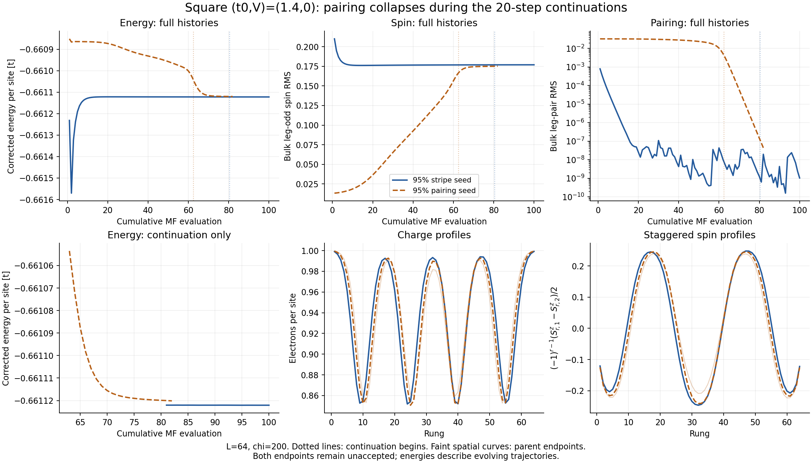
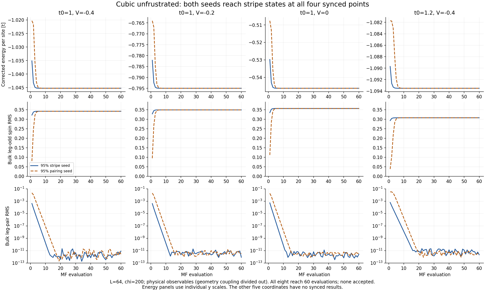
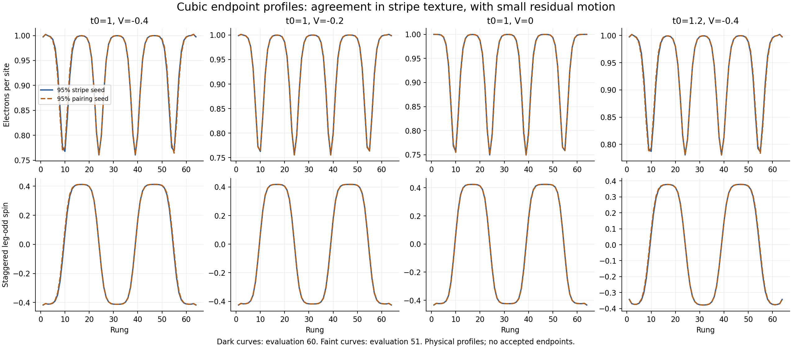

# Square continuation and partial cubic grid — September 16, 2026

Historical snapshot. The [September 18 combined review](../campaign_review_20260918/README.md)
supersedes the partial cubic coverage and cost estimate below with all
18 cubic histories, and adds the finer square cuts, positive-V results and
first trellis endpoint. The square continuation findings here still apply.

The square (t0,V)=(1.4,0) pairing lineage now loses its residual pairing and
reaches a stripe texture. Both starts at each of the four available cubic
coordinates also reach essentially unpaired stripes, substantially stronger
than the corresponding square textures. These are basin observations:
all ten new endpoints remain `maximum_iterations`, `accepted=false`, period 0.

Evidence is the user's locally synchronized `output/`, reviewed during
user-reported Perlmutter maintenance. No live scheduler/accounting query was
made. These ten solvers reached their intended caps; their logs do not indicate
maintenance interruption. The remaining runs' live states cannot be inferred.

## Square: the late pairing collapse is now resolved



| Original seed | New evaluations | Cumulative evaluations | Final bulk spin RMS | Final bulk leg-pair RMS | Final corrected energy/site |
|---|---:|---:|---:|---:|---:|
| 95% stripe | 20 | 100 | 0.176898 | 1.04e-9 | -0.661122074570 |
| 95% pairing | 20 | 82 | 0.175106 | 4.42e-8 | -0.661120141300 |

The pairing start's leg-pair RMS decreases from 0.003307 at cumulative
evaluation 63 to 4.42e-8 at 82, about 75,000-fold. Its spin and charge profiles
approach the stripe-seeded texture. This strengthens the original preliminary
stripe assignment: there is no appreciable surviving paired component in
either observed endpoint. It does not exclude an unvisited metastable state.

The residual convergence failure now mostly concerns stripe position and
profile relaxation. Over the final ten saved evaluations, staggered-spin
zero crossings move by as much as 0.043 rung in the stripe lineage and
0.223 rung in the pairing lineage. Their final zero crossings can still
differ by about 0.91 rung between lineages. Bulk amplitudes and energies hide
this motion because the spatial profiles change much more than their RMS.
The node estimate linearly interpolates sign changes of the staggered
leg-odd spin; it is a position diagnostic, not a fitted collective mode.

- Stripe: energy range is 3.46e-8 t/site, passing 1e-7. Global relative
  residual is 5.06e-4 versus 1e-4, and charge/spin/exchange steps and spans
  fail. The global residual contraction estimate is 0.99627, consistent
  with slow relaxation. The ten-record spin-profile span is 0.00640
  relative, far above 1e-4; this is resolved motion, not a tiny weak channel.
- Pairing: energy range is 1.83e-6 t/site, still above 1e-7. Global relative
  residual is 0.00310. Resolved spin/charge/exchange motion persists. Pairing
  is tiny at the endpoint, but the required ten-record window still contains
  its collapse and fails the pairing window gate.
- Both pass density, inner-DMRG, Hamiltonian-identity and effective-energy
  checks over the configured window where applicable.

The endpoint energy difference is now 1.93e-6 t/site. This measures how close
the evolving trajectories have come energetically; neither is an accepted
solution available for an energetic phase ranking. A flat energy curve alone
would still accept these spatially moving states too early.

## Cubic unfrustrated: rapid, strong stripe formation



Each available point has both starts and 60 evaluations per start. Values
below use physical expectations, with geometry-dependent field couplings
divided out and verified against the saved endpoint correlations.

| (t0,V) | Spin RMS, stripe / pairing seed | Charge standard deviation, stripe / pairing | Largest leg-pair RMS at endpoint | Absolute endpoint energy difference, t/site |
|---|---:|---:|---:|---:|
| (1.0,-0.4) | 0.341539 / 0.341617 | 0.082640 / 0.082696 | 8.38e-12 | 4.84e-8 |
| (1.0,-0.2) | 0.348660 / 0.348670 | 0.084263 / 0.084271 | 3.75e-12 | 5.98e-9 |
| (1.0,0.0) | 0.356220 / 0.356209 | 0.086339 / 0.086330 | 3.57e-12 | 5.02e-9 |
| (1.2,-0.4) | 0.307315 / 0.307413 | 0.076652 / 0.076723 | 2.82e-12 | 1.11e-7 |

The pairing-seeded leg-pair RMS falls below 1e-4 and remains below it by
evaluation 6, 5, 5 and 8, respectively. This contrasts with the much longer
paired transient in the square (1.2,-0.4) history. At that coordinate the
square spin RMS was about 0.175–0.176; the cubic value is about 0.307.
At t0=1 the square values were about 0.247–0.261, versus 0.342–0.356 here.
The enhancement is therefore present in physical spin expectations, not
merely the threefold conversion between spin fields and observables.



All eight have dominant charge DFT mode m=4 (nominal period 16 rungs) and
spin mode m=30 (q/pi=0.9375, staggered-envelope period 32), matching the
stripe family already seen on the square. The profiles show more localized
holes and larger, flatter antiferromagnetic domains. The same phase labels
at these four points do not yet establish where the cubic pairing boundary
lies: none of the t0=1.4 points is locally available.

The cubic energies are much flatter than their original relaxation:
all final ten-record ranges lie between 1.52e-9 and 1.75e-8 t/site and pass
1e-7. Density, inner-DMRG and Hamiltonian consistency gates also pass. The
remaining failures vary:

- **Closest to acceptance:** the stripe start at (1.0,-0.2) fails only the
  charge-modulation window. Its relative span is 1.01306e-4 versus 1e-4,
  a 1.31% miss. Its absolute span is 3.73e-6 versus the 1.5e-6 noise floor.
  The pairing start narrowly misses the same relative span (1.02623e-4)
  and also has spin-step extrapolation failures.
- **Small drift with sensitive extrapolation:** the t0=1 endpoints move
  spin zero crossings by at most 0.0018 rung over evaluations 51–60.
  Some per-step residuals just above the noise floor have near-unit
  contraction estimates, generating large or infinite extrapolation factors.
  An infinite factor is a diagnostic consequence of that estimate, not
  evidence that the physical order is diverging.
- **More resolved drift:** at (1.2,-0.4), node motion reaches 0.0073/0.0093
  rung and the maximum local spin change reaches 0.00106/0.00136 over
  evaluations 51–60. Both fail several channel gates; the pairing start
  also fails the global field window. Their bulk spin RMS changes by only
  0.0011%/0.0017%, again illustrating what an amplitude-only check would miss.

The two seeds retain small stripe-position differences even with very close
energies: maximum local spin differences between endpoints range from
0.0099 to 0.0325. This is consistent with a weak energy dependence on stripe
positions, but does not establish a Goldstone mode or an exact degeneracy.
No accepted-state ranking or threshold change is made by this analysis.

## Scope, cost and next interpretation

There are **520 new MF evaluations**: 480 cubic and 40 square continuation.
The synchronized submission ledgers contain all 18 cubic job IDs, all 12
fine-cut IDs and all four positive-V IDs. Ten cubic starts, all fine cuts
and all positive-V starts have no synced state or stdout in this snapshot.
Submission records do not establish their present scheduler states.

| Available cost evidence | Amount |
|---|---:|
| Square continuation actual allocation, 58383124: 3930 s at quarter node | 0.272917 node-hours |
| Square continuation actual allocation, 58383125: 4025 s at quarter node | 0.279514 node-hours |
| Square continuation actual total | **0.552431 node-hours** |
| Eight cubic runs, saved MF solver times / 14400 | **6.160414 node-hours, estimate excluding allocation overhead** |

The square actual costs come from the synced append-only reconciliation
ledger, timestamp 2026-09-15T23:45:33Z, with both scheduler records COMPLETED.
No cubic reconciliation is present, so an exact cubic allocation cost is not
yet available. The completed cubic starts reserved 24 node-hours; that is a
ceiling, not observed expenditure. This analysis does not modify accounting.

The most informative next results are the cubic t0=1.4 row, the finer square
cuts and the positive-V seeds. The square extension has answered the
qualitative pairing-versus-stripe question at (1.4,0). Preserve its acceptance
flag and defer any further positional relaxation or tolerance adjustment to
an explicit convergence decision. No extra submissions or continuations are
prepared here.

## Reproduction and definitions

Run locally, without DMRG:

```powershell
C:/Python313/python.exe -B -X utf8 ladder_mps_mft/scripts/analyze_two_basin_progress.py
```

- [analysis.json](analysis.json): all source/full/compact/config hashes,
  fingerprints, lineage, jobs, gate diagnostics, costs and endpoint comparisons.
- [histories.csv](histories.csv): all 520 new records, both local and cumulative
  iteration numbers, corrected energy and physical spin/pair RMS.
- Figure PNG/PDF pairs retain full histories. Square ancestry is stitched at
  exact parent restart fields; faint spatial curves identify earlier profiles.
- Spin is (Sz_leg1-Sz_leg2)/2; charge is rung-average density per site.
  Bulk spin and charge use rungs 6–59; leg pairing uses bonds 6–58, matching
  the previous grid report. The charge standard deviation includes finite-size
  boundary-induced structure in this bulk interval.
- Endpoint physical expectations agree with reconstructed measured fields;
  the energy density correction, raw-map adjacency, parent handoff, compact,
  seed/config hashes, fingerprints, log iterations and channel spans were
  checked. The local script completed in about 7 seconds; all three PNGs
  were visually inspected. No scientific solve, acceptance mutation or live
  scheduler action was performed.
