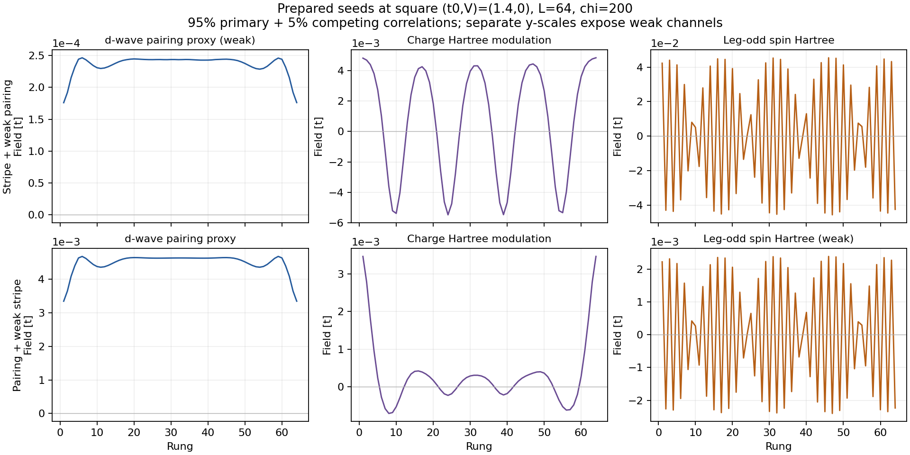

# Square two-basin comparison: chi=200, raw MF updates

The September 8 user-approved plan is prepared locally for all nine square
coordinates: t0=1.0,1.2,1.4 and V=-0.4,-0.2,0.0, with two seed families each.
No new DMRG results or Perlmutter submissions are implied by this preparation.
Higher chi, length, and alternative stripe-wavelength studies are deferred.
The pending cubic and strong-stripe campaigns remain separate.

The latest user revision sets a **95%/5% seed mixture and an 80-evaluation
ceiling**. The earlier 99%/1%, 500-evaluation preview and source ZIP are retained;
the revised preview, snapshot, and run IDs below distinguish this preparation.

## Seeds

The two user-selected reference profiles are:

- Stripe: the legacy completed square `(1.0,0.0)`, L=64, chi=200 state.
  Source SHA-256:
  `ae6a3bfe76ca8f06f2396fd731b18bca8539e0b7ee68df016cc9156fdceeb074`.
- Pairing: the `pairing_dwave_m000_chi200_loose` endpoint of the August 30
  square `(1.4,-0.4)` campaign, L=64, chi=200. This is the explicit uniform
  d-wave lineage, rather than the nearly tied small-stripe lineage selected
  for the earlier grid. Source SHA-256:
  `8a1cf2d64d2fbe0eb59521192b829cab43e19a4d7ac026519ea847f6ac0778b8`.

For each family, the initial correlations are **95% of the primary reference
plus 5% of the competing reference**, retaining normal correlations and edge
profiles. Legacy densities are read from the diagonal normal correlations.
`mean_fields_from_correlations` rebuilds alpha, beta, and Hartree fields using
the target point's exact E_p and geometry kernel. Thus the weak stripe starts
at 5% of the reference stripe amplitude in correlation space, and likewise for
weak pairing; this is not a fixed 5% ratio between unrelated order channels.
The inactive onsite exchange coefficients are zeroed by the normal field
constructor. Every order channel evolves freely afterward.

The fields are inherited from derived seed files; the MPS is a fresh common
random-seed-1404 product start. These are explicit two-reference lineages,
not unbiased starts or restarts of either converged MPS. Reference completion
does not certify the new mixed seeds as self-consistent solutions.



The figure uses the target `(1.4,0)` couplings and separate y-scales to expose
weak channels. The paired reference retains its boundary charge profile, so
its total charge modulation is not solely the added weak stripe. The
[amplitude table](seed_amplitudes.csv) covers all 18 seeds, with bulk RMS over
rungs 6–59. The [PDF](seed_profiles.pdf) is suitable for export.

The hash-checked correlation bundle is
`output/seed_previews/20260908_square_two_basin/references.h5` (about 0.76 MiB),
SHA-256 `e01a1ea7d6be813110870d26377db0df529d1584816c946af78584e1e1fbddc1`.
All 18 local configs, derived field seeds, and fingerprint manifests are under
`output/seed_previews/20260908_square_two_basin/eps005_iter80/grid/`. Their paths are local
preview paths; the Perlmutter preparer regenerates native paths there.

## Numerical contract

The versioned base is
[`phase1_gpu_square_two_basin_chi200_raw.toml`](../../../configs/phase1_gpu_square_two_basin_chi200_raw.toml).

| Control | New value |
|---|---:|
| L / chi | 64 / 200 |
| Maximum MF evaluations per segment | 80 |
| Minimum evaluations before acceptance | 50 |
| Stable fixed-point window | 5 evaluations |
| Global and channel field tolerance | absolute 1e-7 t or relative 1e-4 |
| Inner/outer density tolerance | 1e-5 per site |
| Corrected canonical energy span over the stable window | 1e-8 t/site |
| Inner DMRG sweep-energy tolerance and acceptance gate | 1e-8 t total |
| Maximum sweeps per density solve | 20 |
| DMRG cutoff | 1e-10 |
| Hamiltonian identity / effective-energy consistency | 1e-8 t/site / 1e-8 t/site |
| Solver deadline / Slurm segment ceiling | 11.5 h / 12 h |

**There is no Anderson extrapolation or adaptive damping.** The unmixed probe
budget covers all 80 evaluations; its fallback is also the raw map
(`linear`, damping=min=max=1, adaptive=false). A growing residual during this
raw window does not trigger the accelerated divergence/stagnation stops.
Nonfinite fields and wall-time limits still stop a run. Reaching a limit is
reported as incomplete, rather than converted to convergence.

The new opt-in channel gate separates pairing, spin-even exchange, spin-odd
exchange, uniform charge Hartree, charge modulation, and spin Hartree. Each
retains its full spatial vector. It applies the existing residual-direction
slow-mode extrapolation separately in each channel. A whole channel below
the absolute amplitude floor can pass without a meaningful relative ratio;
above that floor a coherent growing residual prevents acceptance. These are
finite-accuracy trajectory controls, not an independently measured Jacobian
or energy curvature.

The minimum observation window also applies to period-two acceptance. Validated
raw period-two solutions retain both phases and require channel recurrence,
all-phase energy/density/identity checks, and the inner-DMRG sweep gate. They
are not averaged into a uniform field. Their solution energy uses the existing
phase-average convention. An unaccepted recurrence remains under observation
through the raw window. Ordinary configs leave the new gates disabled by
default; pending campaigns must retain their previous source checkout.

## Energies and comparisons

Every saved evaluation already contains canonical energy, density, chemical
potential, and (in current files) target-density-corrected canonical energy.
The new runs also store per-channel amplitudes, residuals, extrapolation
factors/pass flags, and inner-DMRG sweep-gate flags in `history/`.

After the user syncs the new results locally, plot and export every energy
record with:

```powershell
python -B -X utf8 ladder_mps_mft/scripts/plot_mf_energy_histories.py --out ladder_mps_mft/output/two_basin_energy_review ladder_mps_mft/output/phase1_gpu/20260908_square_two_basin_raw_eps005_iter80_anchors/results
julia --startup-file=no --project=ladder_mps_mft ladder_mps_mft/scripts/compare_two_basin_grid.jl ladder_mps_mft/output/phase1_gpu/20260908_square_two_basin_raw_eps005_iter80_anchors ladder_mps_mft/output/two_basin_energy_review/comparison.csv
```

The energy plotter accepts explicit checkpoint files for unfinished runs and
separates Hamiltonian points into panels. It exports CSV, PNG, and PDF. Older
modern histories without the correction array are reconstructed from recorded
mu and density, with that provenance labeled in the CSV.

The grid comparison reuses `compare_variational_branches`. It requires both
current terminal endpoints, acceptance, finite corrected solution energies,
and the four matching model/numerical/implementation/E_p fingerprints, including
agreement with the prepared manifest. It reports incomplete or incompatible
cases explicitly. A gap within ten times the larger five-solution energy span
or 1e-8 t/site tolerance remains unresolved. This resolution screen is not a
rigorous error bound. A lower-energy seed-family label records ancestry; the
final state can merge with its competitor or develop coexistence. Spatial
profiles must determine the phase interpretation.

Raw iteration and longer runs do not guarantee the global minimum. The aim
is a more reliable comparison of the solutions reached from these two
specified families at fixed L and chi.

## Perlmutter handoff (user-run only)

The [source bundle](../../../output/source_bundles/two_basin_raw_20260908_eps005_iter80.zip)
contains the solver, preparation/analysis tools, configs, environment manifests,
registry, and small reference bundle. Its manifest and SHA-256 are recorded
alongside the ZIP. It contains no MPS or new simulation results. The user
transfers it; Codex does not connect or synchronize with Perlmutter.

Start from the managed checkout, then unpack into a fresh source snapshot to
preserve code used by pending jobs. Keep the existing shared accounting ledgers
and campaign output root:

```bash
cd "$CFS/m4863/MPS-MFT/ladder_mps_mft"

# BUNDLE is the path where you transferred two_basin_raw_20260908_eps005_iter80.zip.
BUNDLE="$PWD/output/source_bundles/two_basin_raw_20260908_eps005_iter80.zip"
SNAPSHOT="$PWD/output/source_snapshots/two_basin_raw_20260908_eps005_iter80"
test ! -e "$SNAPSHOT" || { echo "Snapshot already exists; inspect it first."; exit 1; }
mkdir -p "$SNAPSHOT"
unzip -q "$BUNDLE" -d "$SNAPSHOT"
export PHASE1_PROJECT_DIR="$SNAPSHOT"
export PHASE1_REPO_ROOT="$CFS/m4863/MPS-MFT"
export PHASE1_RUN_ROOT="$CFS/m4863/MPS-MFT/ladder_mps_mft/output/phase1_gpu"
export PHASE1_BUDGET_ROOT="$CFS/m4863/MPS-MFT/ladder_mps_mft/output/project_budget"

RUN=20260908_square_two_basin_raw_eps005_iter80_anchors
bash "$SNAPSHOT/slurm/phase1_gpu.sh" budget
bash "$SNAPSHOT/slurm/phase1_gpu.sh" prepare-square-two-basin-raw "$SNAPSHOT/references.h5" "$RUN" anchors
column -ts $'\t' "$PHASE1_RUN_ROOT/$RUN/manifest.tsv" | less -S
```

Preparation does not submit or reserve. After reviewing the manifest and live
budget, the existing guarded submission submits four scientific anchor jobs:

```bash
bash "$SNAPSHOT/slurm/phase1_gpu.sh" submit "$RUN"
bash "$SNAPSHOT/slurm/phase1_gpu.sh" status "$RUN"
```

These are the two families at `(1.4,0)` and `(1.4,-0.4)`. Each 12-hour one-GPU
segment reserves 3 fractional node-hours: **12 for the anchors**. After their
outcomes are reviewed, stage `remainder` under a new run ID prepares the other
14 starts, reserving at most **42** first-segment node-hours. Stage `grid`
prepares all 18 in one manifest if explicitly chosen, at **54** first-segment
node-hours. The three scopes must not be submitted together because `grid`
includes the anchors and remainder. Continuations are separate compute choices;
the 80-iteration ceiling is not a promise of finishing within one allocation.
The iteration cap reduces the work allowed per segment; the 12-hour Slurm
reservation ceiling is unchanged. There are no automatic continuations.

The launcher checks the existing live 400-additional-node-hour cap under its
budget lock before submission. Reconcile completed allocations with the existing
`reconcile "$RUN"` command. This document does not infer remaining budget from
stale local ledgers.

## Local validation

Preparation verifies the reference/source hashes, target E_p mapping, exact
seed readback, nonzero competing fields, raw-only config contract, and matching
fingerprints for each pair. Focused checks exercise weak growing channels,
the minimum window, zero/noise-floor channels, energy drift, missing or failed
inner sweeps, period-two handling, storage, and accepted-only comparison.
Both seed and energy figures were rendered and visually inspected. The energy
plot was validated on existing histories; it is not a new campaign result.
Only CPU startup with fresh product MPS is checked locally; no DMRG or GPU
simulation is run. Exact check counts and commands are in `docs/RUN_LOG.md`.
