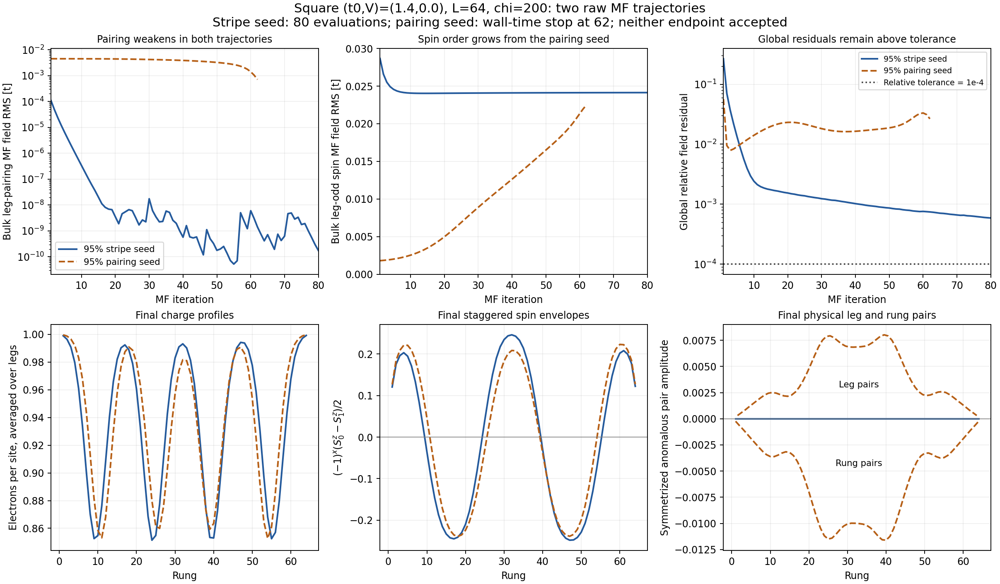
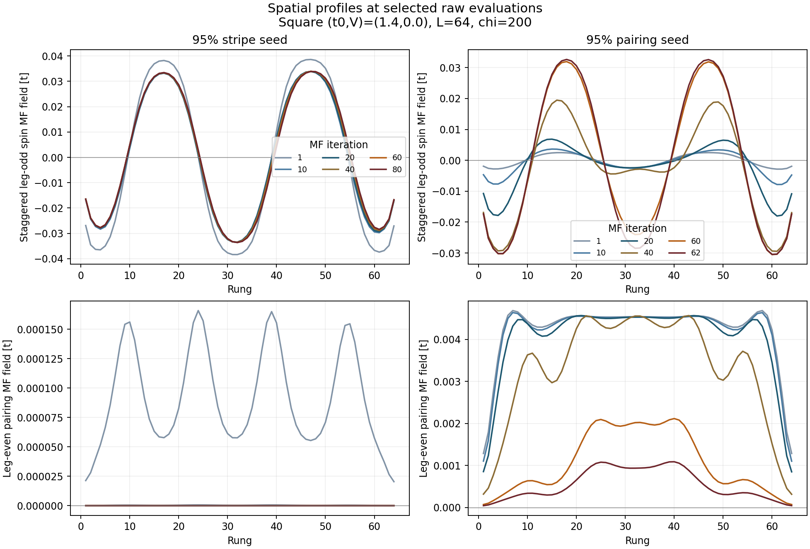
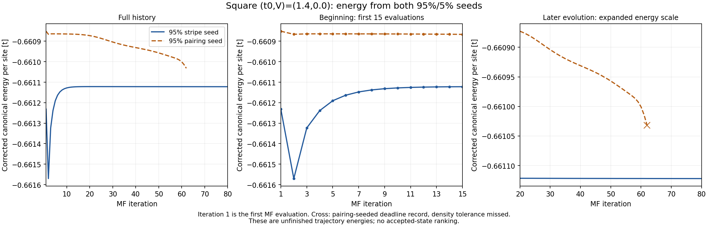

# Square (t0,V)=(1.4,0.0): September 12 two-basin analysis

**The raw trajectories support the delayed growth of stripe order out of the
pairing-dominated start.** The stripe-seeded run has essentially lost pairing
and retains strong CDW/SDW order. The pairing-seeded run is moving toward a
similar stripe texture while its pairing collapses, but it hits the wall-time
limit before settling. Neither endpoint is accepted, and their remaining
convergence failures are much larger than the V=-0.4 noise-floor issue.

These are the original 95%/5%, L=64, chi=200 anchors, with an 80-evaluation
limit and no Anderson. The newly published 40-evaluation controls were not
used by these jobs. Both applied/measured histories, inherited seeds,
configs, compact hashes, and the four comparison fingerprints agree with the
submitted manifest. Each successive input equals the preceding raw output
exactly. The user identified this completed point as `(1.4,0.0)`; the earlier
prose reference to a pending `(1.0,0.0)` is superseded for this analysis.

## Iterations and compute

| Primary seed | Job | Stored evaluations | Outcome | Recorded MF time | Estimated node-hours |
|---|---:|---:|---|---:|---:|
| 95% stripe + 5% pairing | 58093802 | 80 | maximum_iterations | 22,189.829 s | 1.540960 |
| 95% pairing + 5% stripe | 58093803 | 62 | time_limit | 41,341.378 s | 2.870929 |
| **Total** | | **142** | Neither accepted | **63,531.207 s** | **4.411889** |

This cost is the sum of saved `history/wall_seconds`, divided by 3600 and
four for a one-GPU shared allocation. It excludes allocation startup and
finalization. The local accounting ledger has the two 3-node-hour reservations
but no completed-job reconciliation for these jobs. Exact allocation cost
awaits user-supplied `sacct`; no ledger entry was changed or released by this
analysis. User-run Perlmutter command:

```bash
sacct -n -X -j 58093802,58093803 --format=JobIDRaw,State,ElapsedRaw,Start,End -P
```

Iteration 62 contains a saved MF evaluation, but its density search ended on
the deadline: density `0.9375244183`, target error `2.4418e-5`, above `1e-5`.
The preceding records already show the same spin-growth/pairing-decay trend;
the conclusion does not depend on that final record alone.

## Basin and spatial evidence



[PDF](basin_convergence.pdf) · [Complete scalar histories](basin_history.csv) ·
[Every saved spin/pairing rung profile](spatial_history.csv)

- **Stripe start:** bulk leg-pairing MF RMS falls from `1.0782e-4 t` at the
  first measurement to `1.7462e-10 t` at evaluation 80. Bulk leg-odd spin MF
  RMS relaxes from `0.0286595` to `0.0241366 t`. Pairing is negligible, while
  strong spin and charge modulation remain. The last 20 spin RMS values
  change by only 0.0528%, but the full spatial fields still drift coherently.
- **Pairing start:** bulk leg-pairing MF RMS falls from `0.00450157` to
  `0.000709038 t`, retaining 15.75% of its first measured value. Spin RMS
  grows from `0.00181611` to `0.0225097 t`, a factor of 12.39. Across the last
  five saved evaluations, pairing falls another 65.6% while spin grows 12.0%.
  At evaluation 61, before the deadline record, pairing is already down to
  `0.00104179 t` and spin is `0.0219622 t`.
- **The surviving pairing is not a settled coexistence result.** Physical
  final leg/rung anomalous amplitudes still have opposite signs in the
  pairing-seeded run (bulk means `+0.004693` and `-0.006752`), but they are
  rapidly decreasing. The corresponding stripe-seeded means are around
  `1e-9`. Retaining d-wave-like relative signs while amplitude disappears
  does not establish a stable superconducting endpoint.
- **Both have the same dominant stripe wavevectors.** Full-length DFTs of
  physical endpoint charge profiles have dominant mode `m=4`, `q/pi=0.125`;
  physical leg-odd spin has dominant mode `m=30`, `q/pi=0.9375`. The figures
  show four charge-depleted regions and an antiphase staggered spin envelope.
  These are finite-open-ladder profile diagnostics, not a wavelength-convergence
  study. The profiles are similar, not identical: bulk physical spin relative
  L2 difference is 26.4%, and charge profiles differ by up to 0.04365 per site.

Bulk RMS uses rungs 6–59. MF fields are in energy units; the physical spin
plot separately uses `S^z=(n_up-n_down)/2` and the leg-odd combination
`(S^z_0-S^z_1)/2`, with a displayed `(-1)^x` factor to expose the envelope.



[Spatial-evolution PDF](profile_evolution.pdf). Columns have separate pairing
scales because the stripe start's pairing is orders of magnitude smaller.
All 142 evaluations, rather than only these selected snapshots, are exported
in `spatial_history.csv`; the immutable source states retain all MF components.

## Energy from the beginning



[Energy PDF](energy_convergence.pdf) · [All 142 energy records](energy_history.csv)

The stripe energy quickly approaches a nearly flat level, but the pairing
energy keeps changing as stripe order develops. Terminal corrected canonical
energies per site are `-0.661122033082` and `-0.661032086408`, respectively:
their separation is `8.9947e-5 t/site`. This is an unfinished-trajectory
separation, not an accepted-state energetic ranking or a settled phase gap.

The stripe energy spans only `1.3237e-8 t/site` over its final five records
and `1.1651e-7` over its final twenty. The pairing trajectory changes by
`4.5738e-5 t/site` over the final five. Its final density miss is an additional
limitation despite the stored leading target-density correction.

The stripe start's pronounced early dip, reaching `-0.661570432294 t/site`
at evaluation 2 before rising, must not be selected as a lower-energy solution.
The saved functional uses the applied partner fields and current correlations
([solver](../../../src/Solver.jl), [energy definition](../../../src/Variational.jl)).
Those fields are far from self-consistent during startup; this raw SCF trace
is not a guaranteed monotonic minimization of a single self-consistent state.
Hamiltonian identity errors at the endpoints remain below `3e-11 t/site`.

## Why neither is accepted

| Terminal diagnostic | Stripe seed | Pairing seed |
|---|---:|---:|
| Global relative residual, tolerance 1e-4 | 5.8755e-4 | 2.6513e-2 |
| Slow-mode-extrapolated global relative residual | 6.2417e-2 | 1.8531e-1 |
| Spin-channel maximum absolute residual [t] | 4.4907e-5 | 2.0140e-3 |
| Charge-modulation maximum absolute residual [t] | 1.2447e-5 | 3.0457e-4 |
| Inner-DMRG gate passes in last five records | 2 / 5 | 5 / 5 |
| Density window | Pass | Fail |
| Hamiltonian identity / eigenvalue consistency | Pass / Pass | Pass / Pass |

The stripe spin residual is about 90 times the revised `5e-7 t` channel floor;
the pairing start's is about 4,028 times that floor. Stripe spin and charge
residual directions have cosine approximately 0.9999 and contraction estimates
around 0.990–0.993, indicating very slow, coherent profile relaxation. The
extrapolated residual is a diagnostic estimate, not a certified error bound.

**The published 40-step fixed-point checks would not accept either history.**
Neither run has even a single evaluation passing the unchanged global
`absolute <= 1e-7 OR relative <= 1e-4` gate. Therefore neither can pass the
required ten-record fixed-point window, independently of the channel-floor
adjustment. No full replay or solver rerun is needed for that necessary-gate
test. No periodic solution is detected in the saved outcomes.

At iteration 40, the pairing start still retains 85.6% of its first measured
pairing but has already amplified spin almost sevenfold. A 40-step cap leaves
that trajectory unresolved; retaining its failed convergence flag is essential.

## Interpretation and next decision

### September 13 follow-up: why the stripe looks settled

The stripe's amplitude is much better settled than its spatial arrangement.
Decomposing the final spin residual `r = measured - applied` into a part
parallel to the applied field and an orthogonal part gives only
`2.066e-6` of the squared residual in the parallel part. Thus more than
99.999% of its squared residual concerns profile direction/shape rather than
an overall rescaling. The charge-modulation result is similar. About 99.0%
of the spin residual power lies in bulk rungs 6–59, so this is not confined
to the ends. The largest spin changes occur around rungs 39–40.

Linearly interpolated zero crossings of the staggered spin MF envelope show
what the amplitude plot hides:

| Evaluation | First wall | Second wall | Third wall | Fourth wall |
|---|---:|---:|---:|---:|
| 40 | 9.4235 | 24.2250 | 39.2692 | 55.0419 |
| 60 | 9.4096 | 24.2853 | 39.3999 | 55.1830 |
| 80 | 9.4139 | 24.3428 | 39.5165 | 55.2673 |

These are sub-rung profile diagnostics, not a measured physical displacement
of discrete objects. Unequal shifts indicate rearrangement of the texture,
not simply rigid translation. Meanwhile the bulk spin RMS changes only
0.0528% across the last twenty saved values. The nearly flat energy and
stable amplitude therefore coexist with a coherent self-consistency error.

The direct global relative residual is `5.8755e-4` (0.0588%), versus a
`1e-4` (0.01%) threshold. Independently, the stopping diagnostic estimates
`lambda=0.9905866` from consecutive residuals, whose cosine is `0.9998334`.
If that one-mode decay persisted, summing the future updates would multiply
the current step by `1/(1-lambda)=106.23`. The resulting estimate is 6.24%
relative remaining motion. This is deliberately conservative and is not
a certified error bound, a measured physical eigenvalue, or an Anderson
update: it only affects acceptance. Raw fields remain unextrapolated.

The five-record energy gate is also marginally missed (`1.3237e-8` versus
`1e-8 t/site`), and only two of the last five inner-DMRG checks pass. Those
are additional blockers, but the spatial residual is too large and coherent
to explain away as the tiny-channel noise seen at V=-0.4. Finite-chi solver
bias could affect its eventual decay; the present data do not isolate that.

The practical interpretation is **stripe phase identified; strict spatial
self-consistency pending**. The data suggest slow texture relaxation within
the stripe basin, with negligible pairing, rather than a new phase transition.
They do not yet certify an energy minimum or validate a looser acceptance
rule. Residual decompositions and crossing positions are exported in
`analysis.json` and reproduced by the existing analysis script.

The tested finite competing-order perturbation drives the pairing-dominated
start toward stripe CDW/SDW order under raw iteration. This supports the
earlier concern about premature pairing acceptance and contrasts with both
V=-0.4 starts relaxing into a common paired plateau. It does not prove a
thermodynamic minimum or exclude a different basin reached by another seed.

Keep the revised tolerances. This point calls for more evolution, not another
noise-floor relaxation. If allocating a targeted continuation, the pairing
lineage is the immediate priority to see whether its remaining pairing dies
and its stripe profile approaches the other run. The stripe lineage still
needs self-consistency work for a strict energetic comparison. No continuation
or new compute is prepared or submitted by this analysis.

## Reproduction and evidence boundary

The unchanged `plot_phase1_mf_observables.jl` also supports these compact
states. In the local Julia plotting environment, use the explicit campaign
directory; the adapter's no-argument default still selects an August run:

```julia
cd(raw"C:\Users\Kevin\Documents\VS Code\MPS-MFT\ladder_mps_mft")
include("plot_phase1_mf_observables.jl")
run_dir = joinpath("output", "phase1_gpu", "20260908_square_two_basin_95_5_80_anchors")
states = phase1_campaign_states(run_dir)
plot_phase1_mf_profiles_and_middle_histories(states["square__stripe_weak_other_t014_v000_chi200_raw"])
plot_phase1_mf_profiles_and_middle_histories(states["square__pairing_weak_other_t014_v000_chi200_raw"])
```

These are complete measured histories, with the initial seed displayed as
iteration 1: 81 plotted samples for stripe and 63 for pairing. Use
`include_seed=false` to match the 1–80/1–62 evaluation numbering in this
report's analysis figures. Acceptance is shown in the title, not used to
filter out either run. A September 13 local rendering check verified all
five history rows, both slider endpoints, and PNG generation for both files.
The PNGs are under the campaign's
`plots/mf_profiles/profiles_and_saved_histories/` directory. This adapter
plots MF fields; it does not add the separate energy-history figure.

Run locally from the repository root:

```powershell
python -B -X utf8 ladder_mps_mft/scripts/analyze_two_basin_v000.py
```

The script reuses the existing validated loader, with only point selection,
variable history length, and absent threshold crossings generalized. It
verifies compact/config/seed hashes and inherited-field readback, the complete
raw input/output chain, channel residuals recomputed from full vectors, and
log/HDF5 record counts. Corrected energies are independently reconstructed
from canonical energies, mu, and density. Both source hashes are rechecked
after analysis. All three figures were rendered and inspected. No DMRG,
solver changes, source-state relabeling, or remote action occurred.

[Sources and compact hashes](sources.csv) · [Full analysis and provenance](analysis.json) ·
[All 852 channel records](channel_history.csv). The recorded full-source hashes
are provenance; local compact validation does not verify scratch-file presence.
