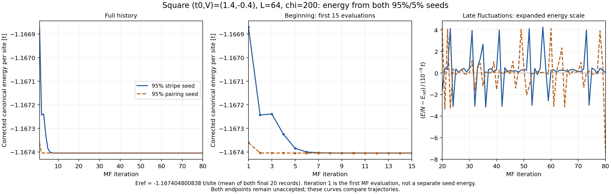
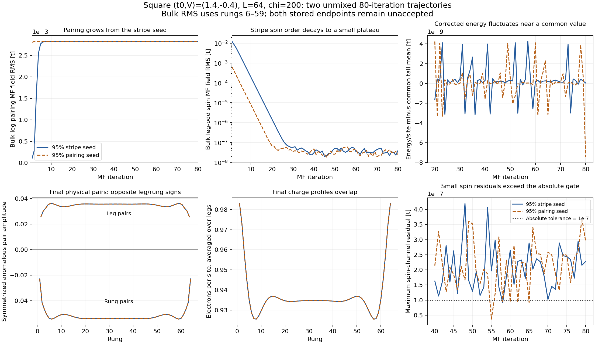

# Two-basin anchors at (t0,V)=(1.4,-0.4): September 10 analysis

**Both starts have reached the same d-wave-like pairing basin to the resolved
accuracy of these L=64, chi=200 runs.** The initially strong stripe disappears;
pairing and charge profiles coincide, and the remaining spin signal fluctuates
at a very small amplitude. The `maximum_iterations` outcomes primarily reflect
over-sensitive channel checks at this numerical floor, with an additional
marginal energy-window failure in the pairing-seeded run. This supports a
settled paired state at these numerical settings; it is not a proof of the
global minimum or a higher-chi stability result. Original acceptance flags
remain false.

## Iterations and actual compute

| Primary seed | Slurm job | MF evaluations | Allocation elapsed | Node-hours |
|---|---:|---:|---:|---:|
| 95% stripe + 5% pairing | 58093799 | 80 | 8 h 33 m 19 s | 2.138819444 |
| 95% pairing + 5% stripe | 58093800 | 80 | 6 h 29 m 50 s | 1.624305556 |
| **Total** | | **160** | **15 h 03 m 09 s** | **3.763125000** |

The user supplied the [allocation-level sacct records](sacct_allocations_supplied.txt)
on September 10. Node-hours use the existing project convention:
`ElapsedRaw / 3600 / 4` for a one-GPU shared allocation. This includes allocation
startup and finalization. Saved MF evaluation times alone total 3.714447030
node-hours; they exclude 0.048677970 node-hours of allocation overhead.

The two completed jobs reserved 6 node-hours, so their unused ceiling is
2.236875 node-hours. All four anchors originally reserved 12 node-hours;
the V=0 jobs 58093802 and 58093803 were PENDING in the user's supplied status.
The locally synced reconciliation ledger has no rows for these four jobs.
This analysis does not modify it or treat the displayed project-wide
61.883819445 active node-hours as the cost of this point. The user can reconcile
the terminal allocations on Perlmutter with the existing
`bash slurm/phase1_gpu.sh reconcile 20260908_square_two_basin_95_5_80_anchors`.

Each state and log contains evaluations 1 through 80. The first input is labeled
`initial`; the next 79 inputs are `unmixed_probe`. Every successive applied
field equals the preceding measured field exactly. No Anderson step occurred.

## Basin evidence



[Full energy figure (PDF)](energy_convergence.pdf). The first two panels share
the same absolute energy scale; the last resolves fluctuations on the
`1e-9 t/site` scale relative to the common final-20-record mean. Iteration 1 is
the first MF evaluation, not an additional energy evaluation of the seed.
The stripe-seeded energy falls from `-1.1668705513` to near `-1.16740480 t/site`
in roughly ten evaluations, with a small increase between evaluations 2 and 3.
The pairing-seeded energy starts at `-1.1673602388 t/site` and is already close
to the plateau after two evaluations. Small late variations remain visible
only on the expanded scale; early energy settling does not alone establish
field convergence.



[PDF figure](basin_convergence.pdf) · [Energy history](energy_history.csv) ·
[Basin history](basin_history.csv) · [All channel diagnostics](channel_history.csv)

- **The stripe component decays.** Bulk leg-odd spin Hartree RMS falls from
  `1.9902e-2` in the strong stripe seed to `3.8782e-8` at iteration 80. The
  pairing seed's perturbation falls from `1.0475e-3` to `2.4933e-8`. Their
  measured spin RMS first drops below `1e-7` at iterations 26 and 20,
  respectively. Late fluctuations stay around `2e-8`–`5e-8`, with no sustained
  coherent regrowth of the original stripe. The bulk convention is rungs 6–59.
- **Pairing settles quickly and agrees between lineages.** The stripe seed's
  leg-pairing MF amplitude grows to the paired plateau within roughly ten
  evaluations; both then remain near a bulk RMS of `2.8236e-3 t`.
  Physical anomalous correlators at the endpoint have positive leg amplitudes
  about `+0.035217` and negative rung amplitudes about `-0.053242` in the stored
  convention, the expected d-wave-like sign structure. These are symmetrized
  anomalous correlators, not normalized pair operators or pair-pair functions.
  The square MF kernel has zero cross-leg alpha entries, so the d-wave
  identification uses physical correlators rather than a zero rung MF field.
- **The endpoints agree throughout space.** The full pair-correlation matrices
  differ by only `5.8521e-5` in relative L2 norm (0.00585%). The largest entry
  difference is `4.0820e-6`; the site-density difference is below `6.23e-6`.
  Charge retains the paired state's boundary profile, rather than becoming
  spatially constant on this open ladder. This is not evidence for a surviving
  strong CDW/SDW stripe basin.
- **Energy has plateaued.** Terminal corrected canonical energies per site are
  `-1.1674048007866273` (stripe seed) and `-1.1674048082719386` (pairing seed).
  Their absolute separation is only `7.4853e-9 t/site`. The full last-40-iteration
  spans are `7.3528e-9` and `1.1544e-8 t/site`. These values establish numerical
  agreement of the trajectories, not an accepted-state energy ranking.

The tiny late spin signal and irregular residual directions are consistent
with a numerical fluctuation floor. Saved trajectories do not independently
measure the source of that floor or establish exact dynamical stability.

## Why acceptance fails

The global relative residuals at iteration 80 are `1.0370e-5` and `1.6365e-5`,
both below `1e-4`. The whole final five-evaluation window passes the global
field, global slow-mode, density, and inner-DMRG sweep checks. Identity and
effective-energy checks also pass. Density errors are `7.8817e-6` and
`5.3828e-6`, below `1e-5` per site. Final DMRG sweep-energy changes are about
`6.13e-9` and `7.13e-9 t` total, below the `1e-8` gate.

| Gate over the last five evaluations | Stripe seed | Pairing seed |
|---|---|---|
| Minimum 50 / global field / global slow mode | Pass | Pass |
| Density / inner DMRG / final energy identities | Pass | Pass |
| Pairing and spin-even exchange channels | Pass | Pass |
| Spin Hartree and spin-odd exchange channels | Fail | Fail |
| Uniform charge channel | Fail | Fail |
| Charge modulation channel | Pass | Fail |
| Corrected energy span <= 1e-8 t/site | Pass: 5.15e-10 | Fail: 1.135e-8 |

There are two distinct channel issues:

1. **The weak-channel absolute floor is too small for these observed
   fluctuations.** The final spin residual maxima are `2.278e-7` and
   `2.939e-7 t`, versus the `1e-7` absolute gate. Spin-odd exchange behaves
   similarly. Relative errors are order one because these channels are nearly
   zero. Their residual directions mostly alternate or fluctuate rather than
   maintaining the coherent growth seen in the older V=0 runs. The pairing
   run's charge-modulation residual also slightly misses both its absolute
   and relative gates on two of the last five evaluations.
2. **The newly added uniform-charge slow-mode check is over-sensitive even
   below its nominal absolute tolerance.** At stripe iteration 80 the raw
   scalar residual is just `1.0581e-9 t`, but its previous residual is
   `3.1353e-10 t`. The same-sign ratio is 3.37484, so the implementation sets
   the extrapolation factor to infinity and fails the gate. Its floor check
   uses the channel's nonzero background amplitude, about `0.002504 t`, not
   the tiny residual. A one-dimensional residual has cosine +1 whenever two
   changes have the same sign, so this is weak evidence for an instability.
   In both runs, every uniform-charge residual in the last 20 iterations is
   below `1.62e-8 t`, yet some are rejected this way.

The pairing run's final energy-window miss is only 13.5% above the requested
`1e-8 t/site`; the longer tail does not show continued energy drift. This is
another resolution-scale issue, not evidence of a different basin.

The status command prints **solution** energies. Those remain `NaN` because
no solution was accepted. All 160 stored iteration energies are finite; these
NaNs do not indicate a failed Hamiltonian calculation.

## Implication for the next runs

I would treat this as strong evidence of a common paired attractor at L=64,
chi=200 and avoid extending these two runs unchanged merely to obtain an
acceptance flag. The useful next change is a noise-aware channel criterion:
avoid extrapolating unresolved scalar fluctuations, calibrate the absolute
floors of the nearly zero spin channels, and match the energy window to the
observed numerical resolution. Preserve detection of resolved, coherent
competing-order growth. Validate that choice against the V=0 anchors before
launching the remaining fourteen starts.

This report changes no solver settings, historical acceptance flags, pending
jobs, or accounting ledgers. The V=0 comparison and higher-chi/length studies
remain separate unresolved evidence.

## Evidence and reproduction

The [analysis JSON](analysis.json) records source/compact/full hashes, matching
model/numerical/implementation/E_p fingerprints, gate outcomes, and timing.
Both compact-state checksums agree with their stateless manifests. Config and
inherited-seed hashes agree with the campaign manifest and state provenance;
the initial applied fields equal the 95%/5% seed fields. Numerical channel
residuals were independently recomputed from the full applied/measured arrays.
Log and HDF5 iteration counts agree. The source files are unchanged.

Reproduce from the local repository root:

```powershell
python -B -X utf8 ladder_mps_mft/scripts/analyze_two_basin_vm04.py
```

The script reads only synchronized files and the user-supplied sacct receipt.
It exports the 160 energy/profile records, 960 channel records, JSON, and static
PNG/PDF figure. The PNG was visually inspected. This is an analysis of stored
data; no DMRG or remote operation is performed.
